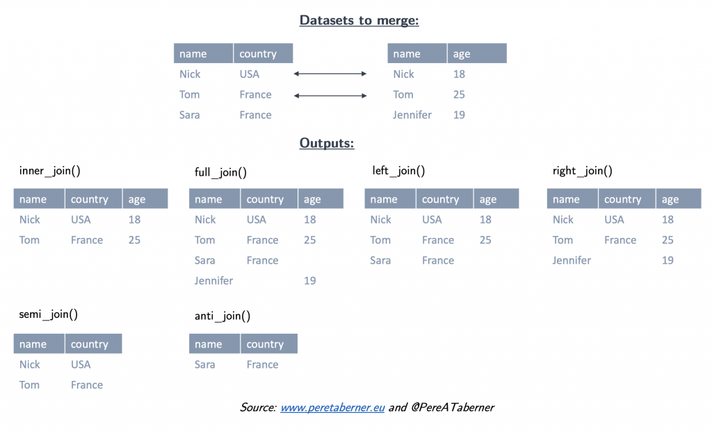

# Prise en main


Pour démarrer :

1 - Télécharger et installer r sur le site du Comprehensive r Archive Network
2 - Télécharger et installer Rstudio.(version free)
3 - Dans le cadre de cet atelier, on adopte la méthode du rMarkdown, On recommande fortement de lire l’ouvrage de référence, même si la prise en main est très rapide. Il est désormais indispensable d’utiliser le package tidyverse et en particulier les fonctions de manipulation et de pipe de fichier de dplyr


## La convention du Rmarkdown

Différentes manières d'interagir avec r sont possibles, dans ce manuel nous adoptions les méthodes [rmarkdown](https://rmarkdown.rstudio.com/lesson-1.html).

La première est le mode console, pour de petite opérations et un utilisateur chevronné, celà peut être commode car rapide mais très rapidement on sera amené à enregistrer les opérations dans des scripts. Mais pour produires des résultats, il faut lancer le script.

Une idée novatrice a été d'intégrer l'ensemble des élements dans un seul document : le script découpé en petits éléments : des chunks, le commentaire et l'analyse verbabe dans un format texte, et le résultat. Dans l'univers python il s'agit des carnets Jupiter, pour r c'est le rmarkdown.

C'est un dialecte du markdown générique adapté au langage r. On recommande au lecteur d'en lire [le manuel](https://bookdown.org/yihui/rmarkdown/) et de le garder dans ses onglets.

Quelques éléments de base :

un document markdown est composé de plusieurs éléments

 * Yalm dans cet entête les éléments essentiels sont définis et paramétrés
 * Texte : il suit les conventions de mise en forme du html :
 ** des # pour les niveau de titres
 ** (x)[*.html] pour des liens et  pour des images
 ** 
 * Les chunks sont isolé par 3 tiks au début et à la fin. 
 * Résultats
 
 
 https://rmarkdown.rstudio.com/authoring_pandoc_markdown.html#Footnotes
 
 On peut en réalité constituer un document complet le le publier en word, en hatml ou mieux en pdf/latex.
 avec les éléments suivant
 
 * bibliographie
 * références
 * liens
 * images

 
## Lire les données

La première étape c'est la lecture des données. On commence par le plus simple la lecture de fichiers locaux, on jette un coup d'oeil à la diversité des formats, on introduit à la technique des accès directs bien utile pour s'assurer que les données sont bien fraiches.
 

### le cas usuels des *.csv

 
```{r 202, echo = TRUE, message=FALSE,warning=FALSE}

df <- read_csv("./Data/BXL_listings.csv")

```

### La diversité des formats

Peu de formats échappent à r, ils peuvent faire appel à des packages spécifiques

 * excell
 * Json
 * shape et autre GIS : 
 * les formats bibliographique : bib et ris
 
## Les accès directs


Interfaces

le génie des API : ne pas se soucier de la mise à jour à chaque fois qu'on lance un calcul. 

exemples :

 * base d'archive de presse
 * api des réseaux sociaux
 * open data
 

 
## `Dplyr` pour manipuler les données

C'est un des packages essentiel de la suite tidyverse.
 
### Des pipes %>%

Une grand part de l'intérêt de dplyr est de reprendre un opérateur de maggritr très utiles : le pipe :  %>%. Celui ci permet de passer le résultats de l'opération à gauche, dans la fonction de droite.

Un exemple simple . Dans la ligne de code suivante, une première fonction lit le fichier CSV, et envoie le résultat de cette lecture dans une fonction graphique élémentaire: compter le nombre d'occurences des modalité de la variable room_type. On reviendra longuement sur ggplot, à ce stade ce qui compte c'est de retenir le procédé.

On va très vite en donner des exemples plus variés.

```{r 203, echo = TRUE, message=FALSE,warning=FALSE}


g <- read_csv("./Data/BXL_listings.csv") %>% 
  ggplot(aes(x=price))+geom_histogram()
g

```


### Des verbes

L'originalité de dplyr est de définir des fonctions comme des verbes. Chaque verbe désigne un type d'action. On va les examiner progressivement


et [dplyr](http://larmarange.github.io/analyse-R/manipuler-les-donnees-avec-dplyr.html) qui va nous permettre de manipuler les données aisément.

Ils sont simples à comprendre : tansformer une variables, filter les obsersation selon un critère, isoler des variables, les groupper pour en calculer des résultats statistiqyes ( somme, moyenne, variance, max min etc) * les déplouer selon un format long ou les distribuer en différents critères, les fusionner enfin selon les grandes modalité du SQL)

#### Mutate

En Français c'est "transformer". On modifie la valeur d'une variable par une fonction plus ou moins complexe, éventuellement en ajoutant des conditions. 

Dans notre exemple, faisant au plus simple, puisque la distribution est asymétrique, une transformation du prix par les log peut donner des résultats intéressants. 

Et c'est le cas. On retrouve une distribution qui semble être gaussienne. 

```{r 204, echo = TRUE, message=FALSE,warning=FALSE}

g <- read_csv("./Data/BXL_listings.csv") %>% 
  mutate(price=log10(price))%>%
  ggplot(aes(x=price))+geom_histogram()
g

```

 
#### Filter


On peut voulir se concentrer sur une sous population. par exemple les chambres privées


```{r 205, echo = TRUE, message=FALSE,warning=FALSE}

g <- read_csv("./Data/BXL_listings.csv") %>% 
  filter(room_type=="Private room")%>% 
  # on note que le signe == est double, c'est pour dire que la variable prend la valeur, ou non, qui est proposée
  mutate(price=log10(price))%>%
  ggplot(aes(x=price))+geom_histogram()
g

```
 * filter

#### select

```{r 206, echo = TRUE, message=FALSE,warning=FALSE}

g <- read_csv("./Data/BXL_listings.csv") %>% 
  filter(room_type=="Private room")%>% 
  # on note que le signe == est double, c'est pour dire que la variable prend la valeur, ou non, qui est proposée
  mutate(price=log10(price))%>%
  ggplot(aes(x=price))+geom_histogram()
g

```

#### Group_by et summarize

c'est une opération clé, en groupant selon les modalités d'une ou pluseirs variables, on peut construire des tableaux aggrégés.On l'associera à `summarize` qui permet de calculer les statistique aggrégé selon le groupe que l'on a définit 

```{r 207, echo = TRUE, message=FALSE,warning=FALSE}

g <- read_csv("./Data/BXL_listings.csv")%>% 
  dplyr::select(neighbourhood, price)%>%
    group_by(neighbourhood ) %>% 
  summarise(price=mean(price))%>% # ce qi permet de calculer le prix moyen par quartier
  ggplot(aes(x=neighbourhood, y=price))+
  geom_bar(stat= "identity")+ coord_flip() +labs(title="Prix moyen des Airbnb à Bruxelles")
g

```


#### gather and spread

Si pour l'habitué des feuilles excell les données croisent des observations avec des variables, ce format n'est pas le seul moyuen de répsenter des données, et pas forcément le meilleurs

 
#### merge

On sera souvent amené à fabriquer des tableaux de donnée en les enrichissant d'un autre. On sera amené  fusionner les données.

Le cas le plus simples est d'ajouter d'autres observation à un fichier de données, si les variables sont identitiques on peut concaténer diffrents jeux de données avec la fonction de base rbind au contraire si les observation sont les mêmes, et que seules les variables sont différentes on peut utiliser cbind. L'équivalent de DPLYR est row_bind et column_bind

mais très souvent on sera dans des cas différents et la fusion des données devra suivre des index




quatre types de fusion

genérale

fusion à gauche

fusion à droite

https://coletl.github.io/tidy_intro/lessons/dplyr_join/dplyr_join.html
 
## Pour aller plus loin

On engage le lecteur à poursuivre avec

 * le bookdown au-delà du markdown
 * une théorie des tidy data
 

## Etude de cas

Le plan de recodage d'un jeu de données qu'on va employer dans les chapitre suivant. Il s'appuie sur le langage de base. 

Un excercice peut être de le réécrire avec  dplyr.

```{r 301, include=TRUE}
df<-readRDS("./data/trustFrAll.rds")

#quelques recodages
#on renomme pour plus de clarte
names(df)[names(df)=="trstun"] <- "NationsUnies" 
names(df)[names(df)=="trstep"] <- "ParlementEurop" 
names(df)[names(df)=="trstlgl"] <- "Justice" 
names(df)[names(df)=="trstplc"] <- "Police" 
names(df)[names(df)=="trstplt"] <- "Politiques" 
names(df)[names(df)=="trstprl"] <-"Parlement" 
names(df)[names(df)=="trstprt"] <- "Partis"
names(df)[names(df)=="pplhlp"] <- "help"
names(df)[names(df)=="pplfair"] <- "fair"
names(df)[names(df)=="ppltrst"] <- "trust"

#on construit les scores de confiance 
df<-df %>% 
  mutate(trust_institut=(Partis+Parlement+Politiques+Police+Justice+NationsUnies+ParlementEurop)*10/7,trust_interpersonnel=(help+fair+trust)*10/3)
df$Year<-2000
#recodage des variables independantes
df$Year[df$essround==1]<-2002
df$Year[df$essround==2]<-2004
df$Year[df$essround==3]<-2006
df$Year[df$essround==4]<-2008
df$Year[df$essround==5]<-2010
df$Year[df$essround==6]<-2012
df$Year[df$essround==7]<-2014
df$Year[df$essround==8]<-2016
df$Year[df$essround==9]<-2018
df$Year<-as.factor(df$Year) 

df$OP<-" "
#ggplot(df,aes(x=lrscale))+geom_histogram()
df$OP[df$lrscale==0] <- "Extrême gauche" 
df$OP[df$lrscale==1] <- "Gauche" 
df$OP[df$lrscale==2] <- "Gauche" 
df$OP[df$lrscale==3] <- "Centre Gauche" 
df$OP[df$lrscale==4] <- "Centre Gauche" 
df$OP[df$lrscale==5] <- "Ni G ni D" 
df$OP[df$lrscale==6] <- "Centre Droit" 
df$OP[df$lrscale==7] <- "Centre Droit" 
df$OP[df$lrscale==8] <- "Droite" 
df$OP[df$lrscale==9] <- "Droite" 
df$OP[df$lrscale==10] <- "Extrême droite" 
#la ligne suivante est pour ordonner les modalités de la variables
df$OP<-factor(df$OP,levels=c("Extrême droite","Droite","Centre Droit","Ni G ni D","Centre Gauche","Gauche","Extrême gauche"))


df$revenu<-" "
df$revenu[df$hincfel>4] <- NA
df$revenu[df$hincfel==1] <- "Vie confortable" 
df$revenu[df$hincfel==2] <- "Se débrouille avec son revenu" 
df$revenu[df$hincfel==3] <- "Revenu insuffisant" 
df$revenu[df$hincfel==4] <- "Revenu très insuffisant" 
df$revenu<-factor(df$revenu,levels=c("Vie confortable","Se débrouille avec son revenu","Revenu insuffisant","Revenu très insuffisant"))

df$habitat<-" "

df$habitat[df$domicil==1]<- "Big city"
df$habitat[df$domicil==2]<-"Suburbs"
df$habitat[df$domicil==3]<-"Town"
df$habitat[df$domicil==4]<-"Village"
df$habitat[df$domicil==5]<-"Countryside"
df$habitat<-factor(df$habitat,levels=c("Big city","Suburbs","Town","Village","Countryside"))

df$genre<-" "

df$genre[df$gndr==1]<-"H"
df$genre[df$gndr==2]<-"F"

df$age<-" "

df$age[df$agea<26]<-"25<"
df$age[df$agea>25 & df$agea<36]<-"26-35"
df$age[df$agea>35 & df$agea<46]<-"36-45"
df$age[df$agea>45 & df$agea<66]<-"46-65"
df$age[df$agea>65 & df$agea<76]<-"66-75"
df$age[df$agea>75]<-"75>"
df$age<-factor(df$age,levels=c("25<","26-35","36-45","46-65","66-75", "75>"))

saveRDS(df, "./data/dfTrust.rds)")
```


 
