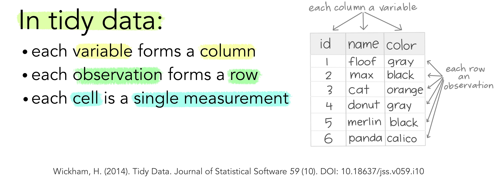

# Prise en main de r 


Pour démarrer :

 * 1 - Télécharger et installer r sur le site du Comprehensive r Archive Network
 * 2 - Télécharger et installer Rstudio.(version free)
 * 3 - Dans le cadre de cet atelier, on adopte la méthode du [rmarkdown](https://rmarkdown.rstudio.com/lesson-1.html). On recommande fortement de lire l’ouvrage de référence, même si la prise en main est très rapide. 
 * 4 - Il est désormais indispensable d’utiliser le package `tidyverse` et en particulier les fonctions de manipulation et de pipe (%>%) fournies par  `dplyr`. Ce sera donc le premier package à installer (attention, il appele de nombreuses dépendences, l'installation peut prendre plusieurs minutes )


## La convention du Rmarkdown

Différentes manières d'interagir avec r sont possibles : la première est le mode console, pour de petite opérations et un utilisateur chevronné, celà peut être commode car rapide mais très rapidement on sera amené à enregistrer les opérations dans des scripts. Une idée novatrice a été d'intégrer l'ensemble des élements dans un seul document : le script découpé en petits éléments : des chunks, le commentaire et l'analyse verbabe dans un format texte, et le résultat. Dans l'univers python il s'agit des carnets Jupiter, pour r c'est le rmarkdown.

C'est un dialecte du markdown générique adapté au langage r. On recommande au lecteur d'en lire [le manuel](https://bookdown.org/yihui/rmarkdown/) et de le garder dans ses onglets.

Quelques éléments de base :

un document markdown est composé de plusieurs éléments

1. Yalm :  dans cet entête les éléments essentiels sont définis et paramétrés
2. Texte : il suit les conventions de mise en forme du html :
   * des # pour les niveau de titres
   * une syntaxe (x)[.xxx] pour des liens vers les URLS ou des images.
3. Les chunks sont isolés par 3 tiks au début et à la fin. 
4. Résultats apparaissent sous les chunks après avoir été exécutés
 
Ce document peut être publié sous différents formats : html, pdf ou même word. 

Il comprend les éléments suivants :

* Plan
* Texte
* Code
* Résultats
* Bibliographie
* Références
* Liens
* Images

## Lire les données

La première étape c'est la lecture des données. On commence par lecture de fichiers locaux, dont les formats sont multiples : csv, tsv, xlsx, Spss, etc... Pour chacun d'eux existe une fonction dédiée.
Le package `readr` contribue à cette tâche pour les fichiers *.csv.

```{r 0201}
df <- read_csv("./Data/BXL_listings.csv")
head(df,5)
```
Il est possible aussi d'accéder en  direct aux données du web, c'est bien utile pour s'assurer que les données sont bien fraîches. Par exemple une connexion à [Nsppolls](https://github.com/nsppolls/nsppolls) qui propose une compilation de tous les sondages d'intention de vote de la présidentielle 2022.

```{r 0202}

df_pol <- read_delim("https://raw.githubusercontent.com/nsppolls/nsppolls/master/presidentielle.csv", 
                     delim = ",", escape_double = FALSE, trim_ws = TRUE)

```
Bien d'autre possibilités sont offertes, on pourra utiliser des API, des programmes de scrapping., ire en bouche des fichiers dans un répertoire, interroger des bases SQL des [SGBD](https://sql.sh/sgbd)) ou d'autres systèmes.  

### La diversité des formats

Peu de formats échappent à r, ils peuvent faire appel à des packages spécifiques

 * excell
 * Json
 * shape et autre données géographiques.
 * les formats bibliographiques sont plus exotique : bib et ris
 * les xml pourront donner des maux de têtes.
 
## `Dplyr` pour manipuler les données

Dès lors que les données sont chargées en mémoire il va souvent être nécessaire d'en travailler, l'aspect et la structure. L'aspect concerne les formats et les significations, les recodages. La structure est relative à la forme des tableaux. Il faudra souvent traiter les données brutes pour proposer à nos modèles des structures appropriées. 

`Dplyr` est un des packages essentiels de la suite tidyverse. Il permet de manipuler aisément les données et mérite une étude approfondie. Un [point de départ](https://dplyr.tidyverse.org/articles/dplyr.html) ou en français : [dplyr](http://larmarange.github.io/analyse-R/manipuler-les-donnees-avec-dplyr.html).

Deux idées sont au coeur de `Dplyr`  d'abord celle du pipe, ensuite celle du verbe. `Dplyr` encourage une approche processus et performative.

### Des pipes %>%

Une grand part de l'intérêt de dplyr est de reprendre un opérateur de magritr très utile : le pipe noté  `data %>% f() %>% g()..`. Celui ci permet de passer le résultat de l'opération à gauche f() sur les données `data`, dans la fonction g() à droite.

Un exemple simple : dans la ligne de code suivante, une première fonction lit le fichier CSV, et envoie le résultat de cette lecture dans une fonction graphique élémentaire: compter les occurrences des modalités de la variable room_type. 

```{r 0203}
g <- read_csv("./Data/BXL_listings.csv") %>% 
  ggplot(aes(x=room_type))+
  geom_bar()+
  coord_flip()+
  labs(x=NULL, y= "Fréquence", title=" Distribution des types de logement à Bruxelles en 2020")
g
```


### Des verbes

L'originalité de `dplyr `est de définir les fonctions comme des verbes. Chaque verbe désigne une action particulière. On va les examiner progressivement.
* transformer une variable, 
* filtrer les observations selon un critère, 
* isoler des variables, 
* les grouper pour en calculer des résultats statistiques (somme, moyenne, variance, max min etc), 
* les déployer selon un format long ou les distribuer en différents critères, 
* les fusionner enfin.

#### Mutate

En Français c'est "transformer". On modifie la valeur d'une variable par une fonction plus ou moins complexe, éventuellement en ajoutant des conditions. 

Dans notre exemple, faisant au plus simple, puisque la distribution est asymétrique, une transformation du prix par les log10 peut donner des résultats intéressants. Et c'est le cas, on retrouve une distribution qui semble être gaussienne. 

```{r 0204}
g <- read_csv("./Data/BXL_listings.csv") %>% 
  mutate(price=log10(price))%>%
  ggplot(aes(x=price))+
  geom_histogram()
g
```

 
#### Filter

On peut vouloir se concentrer sur une sous population. Par exemple les chambres privées.


```{r 0205}
g <- read_csv("./Data/BXL_listings.csv") %>% 
  filter(room_type=="Private room" ) %>% 
    mutate(price=price)%>%
  ggplot(aes(x=log10(price)))+
  geom_histogram()
g
```

#### select

On peut sélectionner des colonnes pour créer un tableau spécifique. On en profite pour introduire '[flextable](https://ardata-fr.github.io/flextable-book/index.html)' , une solution élégante pour éditer des tableaux en html.

```{r 0206}

foo <- read_csv("./Data/BXL_listings.csv") %>%
  dplyr::select(room_type,price) 

ft <- flextable(foo[ sample.int(10),])%>%
   set_header_labels(room_type="Type de logement",
  price = "Prix en euros")%>%
  theme_vanilla()%>% fontsize(ft, size = 7, j = 3)%>%
  autofit()
ft
```

#### Group_by et summarize

c'est une opération clé, en groupant les observations selon les modalités d'une variables, on peut construire des tableaux agrégés avec `summarise` qui permet de calculer de nombreuses statistiques : somme, moyenne, variance, max, min .. à travers les groupes.

```{r 0207}
foo <- read_csv("./Data/BXL_listings.csv")%>% 
  dplyr::select(neighbourhood, price)%>%
    group_by(neighbourhood ) %>% 
  summarise(averageprice=round(mean(price),1),
            nombreoffre=n())

#mise en forme flextable
ft <- flextable(foo)%>% 
  set_header_labels(neighbourhood="Quartier",
  averageprice = "Prix en euros",
  nombreoffre="Nombre d'offre", size=9)%>%  
  fontsize(size = 9)%>%
  theme_vanilla() 
ft
```


#### Pivot_wider et pivot_longer

Si pour l'habitué des feuilles de calculs, les données croisent des observations avec des variables, ce format n'est pas le seul moyen de représenter des données, et pas forcément le meilleur. 

Une théorie des tidy data a été proposé par wickham : Un ensemble de données est une collection de valeurs, généralement des nombres (si elles sont quantitatives) ou des chaînes de caractères (si elles sont qualitatives). Les valeurs sont organisées de deux manières. Chaque valeur appartient à une variable et à une observation. Une variable contient toutes les valeurs qui mesurent le même attribut sous-jacent (comme la hauteur, la température, la durée) dans différentes unités. Une observation contient toutes les valeurs mesurées sur la même unité (comme une personne, ou un jour, ou une course) à travers les attributs.



Pour passer d'un tableau individu x variable à une structure ordonnée, la fonction pivot_longer est particulièrement appropriée. En voici l'anatomie.


Et un exemple numérique :

```{r 0208}

foo <- foo %>%
  pivot_longer(-neighbourhood,names_to= "Variables",values_to = "Values")

ggplot(foo, aes(x=neighbourhood, y=Values, group=Variables))+
  geom_line()+facet_wrap(vars(Variables),scales="free")+
  coord_flip()
```


L'opération inverste est de partir d'un tableau long vers un tableau large. 


On remarquera que l'usage de cette fonction est nécessaire dans l'emploi de ggplot qui suit la logique des tidy data, ou données ordonnées


### Fusionner les données

On sera souvent amené à construire des tableaux de données en les enrichissant par d'autres tableaux et   à fusionner les données.

Le cas le plus simple est d'ajouter d'autres observations à un fichier de données. On distingue deux cas :

 * les deux tableaux concernent les mêmes individus classé dans le même ordre, seules les colonnes diffèrent. On utilisera la fonction `cbind()`
 * si les variables sont identiques mais que les individus sont différents on peut concatène des données avec `rbind()` (L'équivalent de DPLYR est row_bind et column_bind)
 
```{r 0209}
x1<-as.data.frame(c(1,2,3,4,5)) %>%rename(x=1)

y<-as.data.frame(c("a","b","c","d","e"))  %>%rename(y=1)

z<-cbind(x1,y)

ft<-flextable(z)
ft
```

```{r 0210}

x2<-as.data.frame(c(9,8,7,6)) %>%rename(x=1)

w<-rbind(x1,x2)

ft<-flextable(w)
ft
```

 

mais très souvent on sera dans des cas différents et la fusion des données devra suivre des index


Plusieurs types de fusion sont proposées.


genérale

fusion à gauche

fusion à droite

(Voir ce cours)[https://coletl.github.io/tidy_intro/lessons/dplyr_join/dplyr_join.html]
 


 
