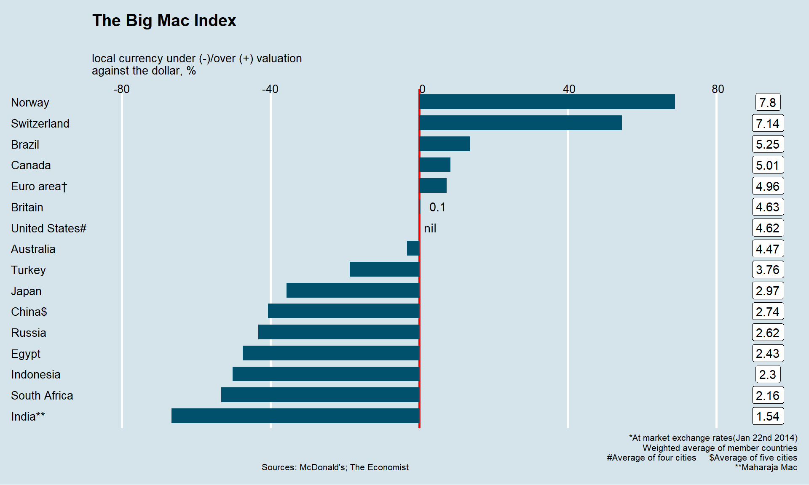

# Introduction à la grammaire des graphiques et à ggplot

Nous avons appris à lire des données, à les manipuler, Nous allons nous intéresser à la manière de les représenter en introduisant le concept de grammaire des graphiques et en appliquant ggplot au traitement des données univariées.

## La grammaire des graphiques

C'est sans doute une des percées conceptuelles la plus intéressante des data sciences. La représentation graphiques des données fait l'objet à la fois d'une explosion créative mais aussi d'une synthèse théorique. C'est l'apport de la grammaire des graphiques. 

Ces outils s'appuient sur l'idée de [grammaire des graphiques](https://www.goodreads.com/book/show/2549408.The_Grammar_of_Graphics). En voici un [clair résumé](https://cfss.uchicago.edu/notes/grammar-of-graphics/).En français il y a toujours le [larmarange](http://larmarange.github.io/analyse-R/intro-ggplot2.html)

### Un modèle en couche

Celle-ci met un ordre dans les éléments qui composent un graphique et les superpose.


 * l'aesthetic definit les éléments que l'on veut représenter : ce qu'on met en abscisse, ce qu'on met en ordonnné, les groupes que l'on veut distinguer. 
 * la geométrie (geom_x)qui définit la forme de représentation
 * les échelles (scale_x)
 * Labelisation (labs)
 * les templates
 * le facetting
 
ggplot est construit selon cette structure. Voici le [book de référence](https://ggplot2-book.org/), qui est au centre de ce cours. On aura besoin de manière assez systématique de manipuler les données avant de les représenter, [dplyr](http://larmarange.github.io/analyse-R/manipuler-les-donnees-avec-dplyr.html) nous permet de le faire aisément.

### Une typologie des représentations

Un point de départ fondamental est la [gallery de ggplot](https://www.r-graph-gallery.com/),, elle présente de manière synthétique la plupart les types de figures qui peuvent être représentées, avec du code facilement reproductible. 


Une classification simple

 * Analyse univariée : une seule variable quantitative ou qualitative.
 * Analyse bivariée : deux variables quali ou quanti/
 * Analyse multivariée
     * les variables sont quantitatives : on analyse des matrices de corrélations
     * les variables sont qualitatives : on analyse des tableaux croisés
 * Analyse temporelles : 
 * Analyse géospatiale : les chloroplèthes.
 * Analyse de réseaux : représenter des noeuds et les arcs qui les relient. Depuis Moreno, 
 * analyse d'arbres : ils sont des sortes de réseaux mais avec une structure hiérarchiques. le dendogramme est le plus connus.
 * Diagramme de flux

### L'esthétique

L'art des couleurs tient dans les palettes on aimera celles de [Wes Anderson](https://github.com/karthik/wesanderson), on peut adorer [`fishualize`](https://nschiett.github.io/fishualize/index.html) si on a un faible pour les poissons tropicaux. 

Pour la théorie voir ...

Si l'on est pas créatif on se reportera à des modèles, certains étant fameux. On laisse le lecteur les rechercher ici ou là . A titre d'exemple, [une belle leçon](https://rpubs.com/ysittaa/BMIsitta), pour reproduire le célèbre [BigMac index](https://www.economist.com/big-mac-index) de The Economist.


## Application à l'analyse univariée

Les données sont extraites de l'ESS, une sélection est disponible [ici]().  Elle couvre les 9 vagues et concernent la France et L'Allemagne. Les variables dépendantes (celles que l'on veut étudier et expliquer) sont les 9 items de la confiance, les variable considérées comme indépendantes (ou explicatives) sont une sélection de variables socio-démographiques : âge, genre, perception du pouvoir d'achat, orientation politique, type d'habitat. 

```{r 301, echo=FALSE}
foo<-readRDS("./data/dfTrust.rds")%>%
  dplyr::select(Year,cntry, trust_institut, trust_interpersonnel)%>%
  group_by(Year,cntry)%>%
  summarise(trust_institut=mean(trust_institut, na.rm=TRUE), 
            trust_interpersonnel=mean(trust_interpersonnel, na.rm=TRUE))
foo$Year<- as.character(foo$Year)
foo$cntry<- as.character(foo$cntry)

foo1<-foo%>%
  pivot_longer(!c(Year,cntry),names_to="Trust", values_to="value" )

ggplot(foo1,aes(x=Year, y=value, group=Trust))+
  geom_line(stat="identity",aes(color=Trust), size=1.2)+
  facet_wrap(vars(cntry))+
  scale_color_manual(values = c("Cyan3","Orange2"))+ theme(
    legend.position = "bottom",
    legend.justification = c("right", "top"),
    legend.box.just = "right",
    legend.margin = margin(6, 6, 6, 6)
    ) + labs(x=NULL, y="Niveau de confiance")+
  ylim(40,60)
                                             
```
L'analyse univarié, comme son nom l'indique, ne s'intéresse qu'à une seule variable. Celle-ci peut être **quantitative** ou **qualitative** et ne comporter qu'un nombre limité de modalités entre lesquels aucune comparaison de grandeur ne peut être faite. Les premières ont le plus souvent dans r un format numérique, les autres correspondent au format *factor*.


### Le cas des variables quantitatives

Les variables quantitatives décrivent une variable dont les valeurs décrivent les quantités d'une grandeur. Elle peuvent être discrètes (dénombrement du d'un nombre d'unités) - le nombre d'habitant), ou continue (le nombre de km parcourus). l'**histogramme** est l'outil de base pour représenter la distribution d'une telle variable. Il représente pour des intervalles de valeurs donnés, la fréquence des observations. 

Sa syntaxe simple comporte d'abord la définition de la variable et de la source de données, puis une des "géométrie" de ggplot : la fonction `geom_histogram`. Dans notre exemple, on va représenter le score de confiance institutionnelle  pour la France en se concentrant sur la dernière vague d'enquête.

```{r 302}
df<-readRDS("./data/dfTrust.rds)")

#filtrage sur 2018 et la France.

foo<-df%>%
  filter(Year=="2018" & cntry=="FR" & !is.na(trust_institut)) 

# on stocke le diagramme dans l'objet g00, 
# pour le réutiliser ultérieurement et pouvoir le compléter.

g00<-ggplot(foo,aes(x=trust_institut))+
  geom_histogram()

g00

g00+labs(title="Distribution de la confiance institutionnelle en France et en 2018",
         x="Confiance institutionnelle", y="Fréquence")
```

On va améliorer l'aspect en 

1. modifiant la couleur et la largeur des barres, 
2. ajoutant un thème,
3. en précisant les éléments textuels (titres, label)
4. en calculant et en représentant la valeur moyenne et l'écart-type . Pour ces statistiques, on emploie les fonction de base : mean, sd et round.

On notera que le titre est défini par la concaténation de plusieurs chaines de caractères avec la fonction `paste0`. On peut ainsi injecter dans le graphique des éléments externes au jeu de données. 

```{r 303}
#on calcule la moyenne
moy=mean(foo$trust_institut, na.rm=TRUE)
sd=sd(foo$trust_institut, na.rm=TRUE)

#avec tous les éléments
g01 <-ggplot(foo,aes(x=trust_institut))+
  geom_histogram(binwidth=5,fill="pink")+
  labs(title= "Distribution de la confiance institutionnelle", 
       subtitle= paste0("moyenne = ",round(moy,2), " - écart-type = ", round(sd,2)),
       caption="ESS2002-2018",
       y= "Fréquence",
       x="Confiance (index de 0 à 100)")+
    geom_vline(xintercept=moy, color="red",size=1.5)+
        geom_segment(y = 0, yend=0,x=moy-sd,xend=moy+sd, color="orange",size=1.5)

g01

```

On peut souhaiter normaliser un tel graphe et prendre pour convention que la surface soit égale à 1. On représentera donc une fonction de densité de probabilité, à laquelle on peut associer une fonction cumulée de la distribution.

On en profite pour introduire l'usage de [`cowplot`](https://cran.r-project.org/web/packages/cowplot/vignettes/introduction.html) qui permet d'associer des graphiques en un seul document. 

```{r 304}
g04<-ggplot(foo,aes(x=trust_institut))+ 
  geom_density(fill="pink2") +
  labs(title= "Fonction de densité de probabilité", 
       caption="ESS2002-2018",
       y= "Fréquence",
       x="Confiance (index de 1 à 100)") 

g05<-ggplot(foo,aes(x=trust_institut))+ 
  stat_ecdf(geom = "step")+
  labs(title= "Fonction de distribution empirique cumulée", 
       caption="ESS2002-2018",
       y= "Fréquence",
       x="Confiance (index de 1 à 100)") 

plot_grid(g04, g05, labels = c('A', 'B'), label_size = 12)

```
Enfin on peut examiner par rapport à une distribution théorique, en l'occurrence une distribution gaussienne, ou normale, de paramètres égaux à la moyenne et la variance empirique de la distribution. C'est ce que `stat_function` permet de réaliser.

L'ajustement est convenable même si on observe une déviation sur la droite. C'est pourquoi on calcule aussi la Kurtosis et le skewness de la distribution.

```{r 305}
#On a déjà calculé la moyenne : mean
#il nous manque l'écart-type et 
sd<-sd(foo$trust_institut, na.rm=TRUE)
library(moments)
sk<-skewness(foo$trust_institut)
ks<-kurtosis(foo$trust_institut)


g05<-ggplot(foo,aes(x=trust_institut))+   
  labs(title= "Distribution de la confiance institutionnelle", caption="ESS2002-2018",y= "frequence",x="confiance (index de 0 à 100)") +
  geom_density(fill="pink2")+
  stat_function(fun = dnorm,color="red",size=1.2, args = list(mean =moy, sd=sd))
   
g05
```

Un grand classique du test de normalité d'une distribution est le diagramme QQ. 

```{r 306}
g06 <- ggplot(foo, aes(sample = trust_institut)) + 
  stat_qq() + stat_qq_line()+ 
  labs(title= "QQplot confiance interpersonnelle", 
       caption="ESS2002-2018",
       y= "Echantillon",x="Théorique") 
g06
```

On finit cette étude détaillée par l'ajustement d'abord d'un modèle (loi normale) aux données. Ensuite d'un modèle de mélange ( Mixture model) par lequel on définit la loi de distribution sous-jascente, comme un mélange entre deux populations normale de paramètres distincts. 

https://tinyheero.github.io/2015/10/13/mixture-model.html

```{r 307}
df0<-df %>% 
  na.omit() 
#library(MASS)
fit<-fitdistr(df0$trust_interpersonnel,"normal") 
param<-as.data.frame(fit$estimate)
mean<-param[,1]
sd<-param[,1]

g07<- g05+stat_function(fun =  dnorm ,color="orange",size=1.2, args = list( mean=mean,  sd=sd))
g07

library(mixtools)
trust = foo$trust_institut
mixmdl = normalmixEM(trust, k=2)
mixmdl$mu
mixmdl$sigma
mixmdl$lambda


plot(mixmdl,which=2)
lines(density(trust), lty=2, lwd=2)
```

Finalement si notre distribution est univariée, car n'étudiant qu'une variable, on peut quand distinguer deux population distinctes. 

### D'autres méthodes

 Il n'y a pas que l'histogramme ou le diagramme de densité, d'autres méthodes sont utiles, surtout quand on veut comparer des groupes (ce sera l'objet du prochain chapitre). Il s'agit du diagramme à moustache et du diagramme en violon.

```{r 308a}

g0306 <- ggplot(foo, aes(y = trust_institut, x=1)) + 
geom_boxplot(fill="Grey") 

g0307 <- ggplot(foo, aes(x=1,y = trust_institut)) + 
geom_violin(fill="Gold") + labs(x="density")

plot_grid(g0306, g0307, labels = c("Boxplot","Violin plot"),
  label_size = 12
)
```


### Quand la variable est qualitative

Quand la variable est qualitative, que ses modalités sont discrètes, la manière de représenter la plus commune est le fameux *camembert* que les experts abhorrent, n diagramme en barre représente mieux les proportions. 

```{r 308}
g08<-ggplot(df,aes(x=age))+
  geom_bar(fill="skyblue")+
  labs(title= "Distribution par classe d'âge", 
       caption="ESS2002-2018",
       y= "fréquence",
       x="Classes d'âge") 
g08
```

Avec quelques améliorations  : contrôle de la couleurs des barres, ajout des % et pivot pour une meilleure lecture.

```{r 309}
foo<-df %>%
  filter(!is.na(age))

g10<-ggplot(foo,aes(x=age, y = prop.table(stat(count)),label = scales::percent(prop.table(stat(count)))))+
  geom_bar(aes(fill = age)) +  
  coord_flip()+ 
  labs(title= "Répartition de la population par classe d'âge", caption="ESS2002-2018",y= "%",x="classes d'age") +
  scale_y_continuous(labels = scales::percent)+ #contrôle de l'échelle des % et du format
  scale_fill_brewer()+
  geom_text(stat = 'count',position = position_dodge(.9),  hjust = 1, size = 3)


g10

g11<-ggplot(foo,aes(x=factor(1),fill=age, y = prop.table(stat(count)),label =scales::percent(prop.table(stat(count)))))+
  geom_bar(width=1) +  
  coord_flip()+ 
  labs(title= "Répartition de la population par classe d'âge", caption="ESS2002-2018",y= "%",x="classes d'age") +
  geom_text(stat = 'count',position = position_dodge(.9),  hjust = 1, size = 3)

g11

```

si on tient au diagramme en secteur

```{r 310}
foo<-df %>%filter(!is.na(age))
g10<-ggplot(foo,aes(x="", y = prop.table(stat(count)),
                    label = scales::percent(prop.table(stat(count)))))+
  geom_bar(aes(fill = age)) +  
  labs(title= "Répartition de la population par classe d'âge", 
       caption="ESS2002-2018",y= "%",x="classes d'age") +
  geom_text(stat = 'count',position = position_dodge(.9),  hjust = 1, size = 3) + 
  coord_polar("y", start=0)

g10
```
https://cran.r-project.org/web/packages/treemapify/vignettes/introduction-to-treemapify.html

si on tient au diagramme en cercle, autant opter pour un treemap avec la bibliothèque treemapifi


```{r 311}
library(treemapify)
tree1<-df %>% 
  mutate(n=1)%>%group_by(age) %>% 
  summarize(n=sum(n)) %>%
  filter(!is.na(age))

g11 <- ggplot(tree1, aes(area = n, fill=n),label=age) +
  geom_treemap() +
  geom_treemap_text(aes(label=age),colour = "white", place = "centre",grow = FALSE)+
  labs(title= "Répartition de la population par classe d'âge", caption="ESS2002-2018",y= NULL,x=NULL) 

g11


```

