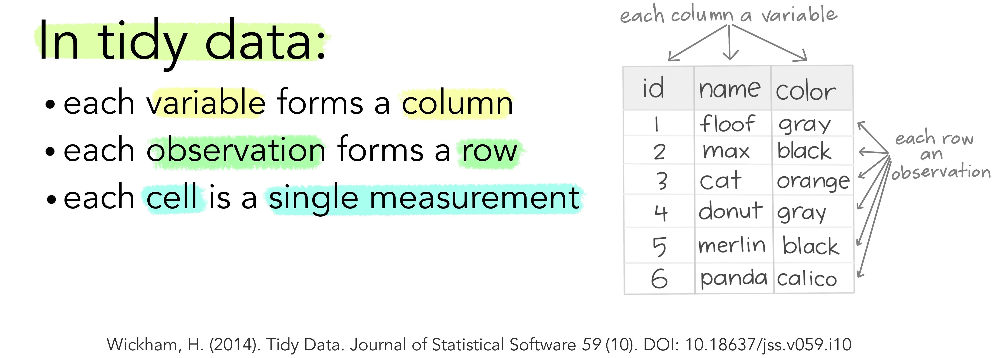

--- 
title: "Introduction aux Data Sciences"
author: "Christophe Benavent - Université Paris Dauphine"
date: "`r Sys.Date()`"
site: bookdown::bookdown_site
output: bookdown::gitbook
documentclass: book
bibliography: [book.bib, packages.bib, datascience.bib]
biblio-style: apalike
link-citations: yes
github-repo: rstudio/bookdown-demo
description: "Cours d'analyse de données et de Datascience"
---


# Avant propos


Ce bookdown présent les éléments d'un cours de data science avec r. Il est reproductible, on peut en cloner les éléments à partir du [repository](https://github.com/BenaventC/DataScienceBook). Le texte est encore hasardeux mais les codes sont vérifiés. Il sera dynamique, modifié à mesure de nos cours, séminaires et ateliers. 

L'illustration de couverture représente l'évolution de la longueur des films de la base [Imbd](https://www.imdb.com/) et raconte en chiffres un aspect de l'histoire du cinéma. Jusqu'aux années 30, la longueur est hétérogène puis elle se se stabilise : les courts-métrages ont une durée de l'ordre de 15 mn qui se raccourcit avec les décennies, ce genre menace de disparaître dans les années 80 et reprend du poil de la bête dans les années 2000. Les films longs voient leur longueur s'accroître et se stabiliser autour d'un peu moins de 100 mn, soit une heure et quarante minutes. On observera enfin qu'au cours des années 1990 les films de taille intermédiaires réapparaissent. On devinera dans cette évolution l'émergence de standards, ou de conventions. Dans ce graphique il y a tous les éléments des data sciences contemporaines : un jeu de données riche et systématique, un modèle statistique fondamental avec la notion de densité de probabilité, une mesure, un critère de comparaison. 

Les diagrammes ridges, c'est ainsi qu'on les appele, sont inspirés de la pochette de l'album [Unknown Pleasures de  Joy division](https://www.youtube.com/watch?v=7PtvIr2oiaE) sorti en pleine période New Wave, en 1979. Un article de Vice en rappele l'[origine et le destin du graphisme](https://i-d.vice.com/fr/article/pabjam/pourquoi-cette-pochette-dalbum-de-joy-division-a-inspire-le-monde-entier) qu'on connait mieux imprimé sur des t-shirt que dans les cours de statistiques.


## Plan du manuel

C'est un projet en cours, Le plan général projeté est le suivant. Certains chapitres sont publiés ( mêmes incomplets) d'autres sont dans les limbes. On les ajoutera  progressivement. 

 * 1 - L'environnement r x
 * 2 - Installation et prise en main x
 * 3 - Usage de ggplot - uni et bivarié x
 * 4 - Usage de ggplot - multivarié x
 * 5 - Tables avec flex
 * 6 - Modèles factoriels (Psych) x
 * 7 - AFC x
 * 8 - MDS  
 * 9 - Clustering x
 * 10 - Analyse de réseaux 
 * 11 - Analyse de variance et régression linéraire x
 * 12 - Modèle linéaire généralisé x
 * 13 - Modèles à décomposition d'erreur x
 * 14 - Modèle d'équations structurelles (Lavaan)
 * 15 - Times series
 * 16 - Analyse spatiale et géographique
 * 17 - Machine learning x
 

## Les jeux de données 

Au cours du développement, plusieurs cas pratiques - souvent réduit en volume pour rester exemplaire, seront employés. Les données sont partagées.

Voici la présentation des sets de données utilisées dans le syllabus. Ils sont disponibles dans le répertoire "./data/"

 * ESS : c'est une très belle base de données de sociologie
 * happydemics : observatoire de la présidentielle2022
 * NSPools
 * Arpur : commerce de paris
 * Botanic
 * ...
 
 
 
## Le cadre technique et les packages utilisés

Ce  _syllabus_ est écrit en **Markdown** [@allaire_rmarkdown_2021] et  avec le package **Bookdown** [@R-bookdown]. Le code s'appuie sur `tidyverse` et emploie largement les ressources de `ggplot`. Les packages seront introduits au fur et à mesure. En voici la liste complète.


```{r 001, echo = TRUE, message=FALSE,warning=FALSE}
options(tinytex.verbose = TRUE)
knitr::opts_chunk$set(echo = TRUE, include=TRUE, cache=TRUE, message=FALSE, warning=FALSE)

#boite à outils et dataviz
library(tidyverse) # inclut ggplot pour la viz, readr et 
library(cowplot) #pour créer des graphiques composés
library(ggridges) # le joy division touch
library(ggmosaic)
library(ggcorrplot)

#networks
library(igraph)
library(ggraph)

# Accéder aux données
library(rtweet)  # une interface efficace pour interroger l'api de Twitter

# NLP
library(tokenizers)
library(quanteda)
library(quanteda.textstats)
library(udpipe) #annotation syntaxique
library(tidytext)
library(cleanNLP) #annotation syntaxique

#sentiment
library(syuzhet)             #analyse du sentimeent


#mise en page des tableaux
library(flextable)


#statistiques et modèles
library(lme4) #pour des modèles plus complexe que les mco
library(jtools) #une série d'utiltaire pour bien représenter les résultats
library(interactions) #traitement des interactions
library(nlme)#pour les hlm
library(psych) #pour la psychometrie

#ACP et AFCM

library("FactoMineR")
library("factoextra")


#ML
library(caret)

#utilitaires
library(rcompanion)

#graphismes
library(ggthemes)
theme_set(theme_bw())


#palettes
library(colorspace) #pour les couleurs
library(wesanderson)

#regression
library(lme4)
library(jtools)
library(interactions)
library(betareg)


# Utilitaires

library(citr) #pour insérer des références dans le markdown

#config plot
theme_set(theme_minimal())
```


L'ensemble du code est disponible [sur github](https://github.com/BenaventC/Datasciences). A ce stade c'est encore embryonnaire. Les proches et nos étudiants pourrons cependant y voir l'évolution du projet et de la [progression](https://benaventc.github.io/Datascience/)

Quelques conventions d'écriture du code r

 * On dénomme les dataframes  de manière générale `df`, les tableaux intermédiaires sont appelé systématiquement `foo`
 * Gestion des palettes de couleurs
  ** une couleur :" royalblue"
  ** deux couleurs
  ** 3 à 7 couleurs
 * On emploie autant que possible le dialecte tidy.
 * Les chunks sont notés en 4 chiffre : 2 pour le chapitre et deux pour le chunck. 0502 est le second chunk du chapitre 5.
 * On commente au maximum les lignes de code pour épargner le corps du texte et le rendre lisible


## A faire

todo list :

* insérer un compteur google analytics ( voir https://stackoverflow.com/questions/41376989/how-to-include-google-analytics-in-an-rmarkdown-generated-github-page)
* modifier le titre en haut à gauche
* vérifier le système de références voir ( https://doc.isara.fr/tuto-zothero-5-bibtex-rmarkdown-zotero/)
* Vérifier la publication en pdf
 

<!--chapter:end:index.Rmd-->

# Introduction aux data sciences {#intro}

L'objet du manuel est de donner un aperçu général des méthodes d'analyses de données et de data science.

## Science ou technique ?

Plutôt que le terme consacré de Data sciences, il vaudrait mieux parler de data ingénierie dans la mesure où le data scientiste participe à un processus de production qui va de l'acquisition des donnée à leur propagation dans l'organisation ou la société. La technique domine sur la science et l'unité se trouve dans l'intégration de ce processus. La révolution des données vient de l'interopérabilité croissante de ces techniques et d'une intégration qui fluidifie le passage d'une étape à une autre. Standards et langages en sont les éléments clés. 

Du côté des sciences, ce dont bénéficie l'univers des data sciences, c'est l'héritage de cultures statistiques foisonnantes qui après s'être développées dans leur cocon disciplinaire, se retrouvent désormais rassemblées dans un même langage. Bien sur il y a de manière sous-jascente les mathématiques et les statistiques qui construisent les fondements des modèles et des techniques. Mais leur développement s'est fait souvent quand le scientifique se retrouve face à un problème où une observation. 

Prenons le cas des psychologues qui ont inventé l'analyse factorielle dans le but de pouvoir tester certains de leurs concepts : un degré d'intelligence, une personnalité, des attitudes. 

Ou celui des écologues qui souhaitent estimer une population de poisson dans une rivière, problème qui a donné naissance aux modèles de capture/recapture. On pourrait ajouter les géographes avec les modèles d'analyse spatiale, les financiers face à la variabilité des cours des places boursières, etc. Celui des économètres est peut-être le plus évident. Les biostatisticiens sont des contributeurs importants.  

Ce que la technique apporte c'est l'intégration par un langage et donc un ensemble de conventions, incarnées par r et python,  d’algorithmes, et de programmes qui ne sont plus spécifique à un domaine, mais peuvent circuler de l'un à l'autre. C'est ainsi que le catalogues de toutes les techniques psychométriques devient accessible aux autres disciplines par le biais d'un package en particulier , psych. De la même manière l'outillage des linguiste devient accessible aux autres disciplines, pensons aux économiste qui intéègre dans le indicateurs des sources textuelle telle que l'analyse du sentiment.

L'interopérabilité apportée par ces langages ne se définit pas que par l'algorithme qui aurait été porté d'un autre langage vers celui-ci (des cas de réécriture ?) mais aussi par des programme passerelle qui à partir de r permettent d'activité des algorithme écrit en C, en javascript ou tout autre langage "plus informatiques" et souvent plus efficace. 

## Une courte histoires des logiciels statistiques

Et c'est ce qu'on observe dans l'évolution des logiciels

 * 1980 : statitcf
 * 1980 : SAS comme accès à r
 * 1990 : SPSS
 * 1997 : s puis r
 * ? : python

http://www.deenov.com/blog-deenov/histoire-du-logiciel-spad.aspx


Un des grand mouvement du domaine est l'hésitation entre le programmatique et le no-code. La pression commerciale conduit certains acteurs à encourager l'usage de sur-couche logiciel qui débarrasse l'utilisateur de l'exigence techniques, il peut se laisser guider par l'intuition, mais l'aliène en dissimulant la mécanique profonde des processus de traitement des données. 

Le succès de python et de r réside dans 

* La modularisation : langage de base /fonction/ package et notion de dépendance
* L'interopérabilité pas toujours parfaite ( versions, classes de données)
* La cumulativité : les fonction s'ajoutent aux fonctions, se sédimentent
* L'accès 

## Le processus de traitement des données

Les data sciences ne sont finalement que l'intégration d'un flot de traitement des données qui va de l'acquisition à la divulgation. 


 * Acquisition 
 * Codification , filtrage et correction d'erreur
 * Structuration des données : api, open data
 * Exploration
 * Modélisation :
 * validation : tests versus AB testing
 * Simulation et décision
 * Vizualisation et sensemaking
 * Déploiement : 
 * Contrôle :
 * Publication : dash board, pdf , slide etc, webb site

## Les facteurs sociaux du développement des datasciences

Ces développements sont favorisés par un environnement fertile dont quatre facteurs se renforcent mutuellement. La constitution d'un système de communication commun organisé autour de peu de langage, et d'un ensemble de normes de données mais aussi la vitalité d'une communauté. La multiplicité des sources de données et l'évolution des technologies de la mesure et du nombre constitue un second groupe de facteurs. 

### Une lingua franca

La lingua franca est la langue des ports et du commerce de la méditerranée au XIVème siècle, un mélange de langage qui sert l'échange, un commun pourrait-on dire aujourd'hui. C'est ce que sont devenus python et r parmi d'autres, la seconde langue après l'anglais qui s'est imposé comme la langue d'écriture. Le langage des scientifiques est sans doute désormais un pidgin, un créole d'anglais, et de r ou de python, sans compter les sparc, les C+++ ou javascript. Les langues de la donnée se mêlent volontiers, elle sont de plus en plus agnostique. 

L’environnement r par exemple devient de plus en plus ouverts à python, à la fois de manière directe en permettant de coder dans un même document des calculs en r pluis en python, mais aussi de manière indirecte parce que prolifèrent des packages passerelles permettant d'aller chercher des ressources écrites dans un autre langage. 

### Une communauté

Le second facteur, intimement lié au premier, est la constitution d’une large communauté de développeurs et utilisateurs qui se retrouvent aujourd’hui dans des plateformes de dépôts (Github, Gitlab), de plateformes de type quora (StalkOverFlow), de tutoriaux, de blogs (BloggeR), de journaux (Journal of Statistical Software) et de bookdown. Des ressources abondantes sont disponibles et facilitent la formation des chercheurs et des data scientists. Toutes les conditions sont réunies pour  engendrer une effervescence créative. 

Cette communauté se reproduit à petite échelles dans les procédures de laboratoire et les conventions de travail en commun des chercheurs. Elle peut se développer autant verticalement qu'horizontalement : des hubs qui concentrent l'ensemble des acteurs et des ressources, qu'un grand nombre de micro communauté focalisés sur des problèmes très locaux.

### La multiplication des sources de données.

Le troisième est la multiplication des sources de données et leur facilité d’accès. Les données privées, et en particulier celles des réseaux sociaux,  même si un péage doit être payé pour accéder aux APIs, popularisent le traitement de données massives. 

Le mouvement des données ouvertes (open data) proposent et facilitent accès à des milliers de corps de données : retards de la SNCF, grand débat, le formidable travail de l’Insee, european survey etc.
 
 
### de la statistique à l'IA

Le retour au boites noires dans les années 2000. Ce qui distingue les statistiques traditionnelles de l'approche machine learning réside d'abord par une approche de la modélisation différente. 

Les modèles statistiques et économétriques considèrent une structure de relation, la spécification du modèle (ex : le modèle linéaire), mais aussi des modèles de distribution des erreurs qui définissent le cadre d'estimation. L'évaluation passe par le test des hypothèses sur les paramètres et par la qualité d'ajustement. 

Le machine learning, se concentre sur la valeur prédictive, et considère n'importe quelle spécification même si elle est peu intelligible et comprend de grandes quantités de paramètres sur lesquels aucun test n'est produit. 

Les deux approches ont plutôt tendance à ce compléter, les première testant des théories, les secondes procurant aux première de nouvelles hypothèse par de nouvelle mesure. Pour en donner un exemple simple, l'analyse de sentiment emploie des modèles complexes pour le prédire avec le seul texte, l'IA permet d'enrichir des données empiriques par exemple en testant en finance la relation de cet indicateurs aux prix de marché. Un autre exemple en marketing. 

Les méthodes disponibles se sont accumulées depuis ces dernières 20 années. faisons-en une courte liste.

* 1956  :perceptron
* 1963 : arbre de décision
* 2005 : CNN
* 2008 : lda topic
* 2013 : word2vec
* 2018 : transformers
* 

KNN, SVM, rf et le retour des réseaux de neurones. 

## Conclusion

Il ne reste plus qu'à soulever le capot et de mettre les mains dans le cambouis.

Et à se rappeler que si la nécessité de se faire remarquer à conduit les acteurs du domaine à envisager des data sciences, que c'est d'abord un art d'écriture, et une pratique qui permet à leurs artisans de s'échanger des secrets de fabrique. 

On remerciera tous ceux qui développent des packages, nous aurons le point de vue de ceux qui les utilisent. Ce cours est aussi un livre de recette, celui d'un chercheur en sciences sociales qui picore dans l'immensité de la production pour trouver des procédures reproductibles par ses étudiants. 


<!--chapter:end:01-intro.Rmd-->

# Prise en main de r 


Pour démarrer :

 * 1 - Télécharger et installer r sur le site du Comprehensive r Archive Network
 * 2 - Télécharger et installer Rstudio.(version free)
 * 3 - Dans le cadre de cet atelier, on adopte la méthode du [rmarkdown](https://rmarkdown.rstudio.com/lesson-1.html). On recommande fortement de lire l’ouvrage de référence, même si la prise en main est très rapide. 
 * 4 - Il est désormais indispensable d’utiliser le package `tidyverse` et en particulier les fonctions de manipulation et de pipe (%>%) fournies par  `dplyr`. Ce sera donc le premier package à installer (attention, il appele de nombreuses dépendences, l'installation peut prendre plusieurs minutes )


## La convention du Rmarkdown

Différentes manières d'interagir avec r sont possibles : la première est le mode console, pour de petite opérations et un utilisateur chevronné, celà peut être commode car rapide mais très rapidement on sera amené à enregistrer les opérations dans des scripts. Une idée novatrice a été d'intégrer l'ensemble des élements dans un seul document : le script découpé en petits éléments : des chunks, le commentaire et l'analyse verbabe dans un format texte, et le résultat. Dans l'univers python il s'agit des carnets Jupiter, pour r c'est le rmarkdown.

C'est un dialecte du markdown générique adapté au langage r. On recommande au lecteur d'en lire [le manuel](https://bookdown.org/yihui/rmarkdown/) et de le garder dans ses onglets.

Quelques éléments de base :

un document markdown est composé de plusieurs éléments

1. Yalm :  dans cet entête les éléments essentiels sont définis et paramétrés
2. Texte : il suit les conventions de mise en forme du html :
   * des # pour les niveau de titres
   * une syntaxe (x)[.xxx] pour des liens vers les URLS ou des images.
3. Les chunks sont isolés par 3 tiks au début et à la fin. 
4. Résultats apparaissent sous les chunks après avoir été exécutés
 
Ce document peut être publié sous différents formats : html, pdf ou même word. 

Il comprend les éléments suivants :

* Plan
* Texte
* Code
* Résultats
* Bibliographie
* Références
* Liens
* Images

## Lire les données

La première étape c'est la lecture des données. On commence par lecture de fichiers locaux, dont les formats sont multiples : csv, tsv, xlsx, Spss, etc... Pour chacun d'eux existe une fonction dédiée.
Le package `readr` contribue à cette tâche pour les fichiers *.csv.

```{r 0201}
df <- read_csv("./Data/BXL_listings.csv")
head(df,5)
```
Il est possible aussi d'accéder en  direct aux données du web, c'est bien utile pour s'assurer que les données sont bien fraîches. Par exemple une connexion à [Nsppolls](https://github.com/nsppolls/nsppolls) qui propose une compilation de tous les sondages d'intention de vote de la présidentielle 2022.

```{r 0202}

df_pol <- read_delim("https://raw.githubusercontent.com/nsppolls/nsppolls/master/presidentielle.csv", 
                     delim = ",", escape_double = FALSE, trim_ws = TRUE)

```
Bien d'autre possibilités sont offertes, on pourra utiliser des API, des programmes de scrapping., ire en bouche des fichiers dans un répertoire, interroger des bases SQL des [SGBD](https://sql.sh/sgbd)) ou d'autres systèmes.  

### La diversité des formats

Peu de formats échappent à r, ils peuvent faire appel à des packages spécifiques

 * excell
 * Json
 * shape et autre données géographiques.
 * les formats bibliographiques sont plus exotique : bib et ris
 * les xml pourront donner des maux de têtes.
 
## `Dplyr` pour manipuler les données

Dès lors que les données sont chargées en mémoire il va souvent être nécessaire d'en travailler, l'aspect et la structure. L'aspect concerne les formats et les significations, les recodages. La structure est relative à la forme des tableaux. Il faudra souvent traiter les données brutes pour proposer à nos modèles des structures appropriées. 

`Dplyr` est un des packages essentiels de la suite tidyverse. Il permet de manipuler aisément les données et mérite une étude approfondie. Un [point de départ](https://dplyr.tidyverse.org/articles/dplyr.html) ou en français : [dplyr](http://larmarange.github.io/analyse-R/manipuler-les-donnees-avec-dplyr.html).

Deux idées sont au coeur de `Dplyr`  d'abord celle du pipe, ensuite celle du verbe. `Dplyr` encourage une approche processus et performative.

### Des pipes %>%

Une grand part de l'intérêt de dplyr est de reprendre un opérateur de magritr très utile : le pipe noté  `data %>% f() %>% g()..`. Celui ci permet de passer le résultat de l'opération à gauche f() sur les données `data`, dans la fonction g() à droite.

Un exemple simple : dans la ligne de code suivante, une première fonction lit le fichier CSV, et envoie le résultat de cette lecture dans une fonction graphique élémentaire: compter les occurrences des modalités de la variable room_type. 

```{r 0203}
g <- read_csv("./Data/BXL_listings.csv") %>% 
  ggplot(aes(x=room_type))+
  geom_bar()+
  coord_flip()+
  labs(x=NULL, y= "Fréquence", title=" Distribution des types de logement à Bruxelles en 2020")
g
```


### Des verbes

L'originalité de `dplyr `est de définir les fonctions comme des verbes. Chaque verbe désigne une action particulière. On va les examiner progressivement.
* transformer une variable, 
* filtrer les observations selon un critère, 
* isoler des variables, 
* les grouper pour en calculer des résultats statistiques (somme, moyenne, variance, max min etc), 
* les déployer selon un format long ou les distribuer en différents critères, 
* les fusionner enfin.

#### Mutate

En Français c'est "transformer". On modifie la valeur d'une variable par une fonction plus ou moins complexe, éventuellement en ajoutant des conditions. 

Dans notre exemple, faisant au plus simple, puisque la distribution est asymétrique, une transformation du prix par les log10 peut donner des résultats intéressants. Et c'est le cas, on retrouve une distribution qui semble être gaussienne. 

```{r 0204}
g <- read_csv("./Data/BXL_listings.csv") %>% 
  mutate(price=log10(price))%>%
  ggplot(aes(x=price))+
  geom_histogram()
g
```

 
#### Filter

On peut vouloir se concentrer sur une sous population. Par exemple les chambres privées.


```{r 0205}
g <- read_csv("./Data/BXL_listings.csv") %>% 
  filter(room_type=="Private room" ) %>% 
    mutate(price=price)%>%
  ggplot(aes(x=log10(price)))+
  geom_histogram()
g
```

#### select

On peut sélectionner des colonnes pour créer un tableau spécifique. On en profite pour introduire '[flextable](https://ardata-fr.github.io/flextable-book/index.html)' , une solution élégante pour éditer des tableaux en html.

```{r 0206}

foo <- read_csv("./Data/BXL_listings.csv") %>%
  dplyr::select(room_type,price) 

ft <- flextable(foo[ sample.int(10),])%>%
   set_header_labels(room_type="Type de logement",
  price = "Prix en euros")%>%
  theme_vanilla()%>% fontsize(ft, size = 7, j = 3)%>%
  autofit()
ft
```

#### Group_by et summarize

c'est une opération clé, en groupant les observations selon les modalités d'une variables, on peut construire des tableaux agrégés avec `summarise` qui permet de calculer de nombreuses statistiques : somme, moyenne, variance, max, min .. à travers les groupes.

```{r 0207}
foo <- read_csv("./Data/BXL_listings.csv")%>% 
  dplyr::select(neighbourhood, price)%>%
    group_by(neighbourhood ) %>% 
  summarise(averageprice=round(mean(price),1),
            nombreoffre=n())

#mise en forme flextable
ft <- flextable(foo)%>% 
  set_header_labels(neighbourhood="Quartier",
  averageprice = "Prix en euros",
  nombreoffre="Nombre d'offre", size=9)%>%  
  fontsize(size = 9)%>%
  theme_vanilla() 
ft

```


#### Pivot_wider et pivot_longer

Si pour l'habitué des feuilles de calculs les données croisent des observations avec des variables, ce format n'est pas le seul moyen de représenter des données, et pas forcément le meilleur. 

Une théorie des tidy data a été proposé par wickham : Un ensemble de données est une collection de valeurs, généralement des nombres (si elles sont quantitatives) ou des chaînes de caractères (si elles sont qualitatives). Les valeurs sont organisées de deux manières. Chaque valeur appartient à une variable et à une observation. Une variable contient toutes les valeurs qui mesurent le même attribut sous-jacent (comme la hauteur, la température, la durée) dans différentes unités. Une observation contient toutes les valeurs mesurées sur la même unité (comme une personne, ou un jour, ou une course) à travers les attributs.



Pour passer d'un tableau individu x variable à une structure ordonnée, la fonction pivot_longer est particulièrement appropriée. En voici l'anatomie.


Et un exemple numérique :

```{r 0208}

foo <- foo %>%
  pivot_longer(-neighbourhood,names_to= "Variables",values_to = "Values")

ggplot(foo, aes(x=neighbourhood, y=Values, group=Variables))+
  geom_line()+facet_wrap(vars(Variables),scales="free")+
  coord_flip()
```


L'opération inverste est de partir d'un tableau long vers un tableau large. 


On remarquera que l'usage de cette fonction est nécessaire dans l'emploi de ggplot qui suit la logique des tidy data, ou données ordonnées


### Fusionner les données

On sera souvent amené à construire des tableaux de données en les enrichissant par d'autres tableaux et   à fusionner les données.

Le cas le plus simple est d'ajouter d'autres observations à un fichier de données. On distingue deux cas :

 * les deux tableaux concernent les mêmes individus classé dans le même ordre, seules les colonnes diffèrent. On utilisera la fonction `cbind()`
 * si les variables sont identiques mais que les individus sont différents on peut concatène des données avec `rbind()` (L'équivalent de DPLYR est row_bind et column_bind)
 
```{r 0209}
x1<-as.data.frame(c(1,2,3,4,5)) %>%rename(x=1)

y<-as.data.frame(c("a","b","c","d","e"))  %>%rename(y=1)

z<-cbind(x1,y)

ft<-flextable(z)
ft
```

```{r 0210}

x2<-as.data.frame(c(9,8,7,6)) %>%rename(x=1)

w<-rbind(x1,x2)

ft<-flextable(w)
ft
```

 

mais très souvent on sera dans des cas différents et la fusion des données devra suivre des index


Plusieurs types de fusion sont proposées.


genérale

fusion à gauche

fusion à droite

(Voir ce cours)[https://coletl.github.io/tidy_intro/lessons/dplyr_join/dplyr_join.html]
 


 

<!--chapter:end:02-PriseEnMain.Rmd-->

# Analyses univariées

Nous avons appris à lire des données, à les manipuler, nous avons le droit d'être pressé de les représenter de manière immédiatement lisible, par des dataviz. 

On présente d'abord rapidement le concept de grammaire des graphiques

On se concentre ensuite sur un cas d'étude

On décline.

## La grammaire des graphiques

C'est sans doute une des percées conceptuelles laplus intéressante des datasciences. La représentation graphhiques des données fait l'objet à la fois d'une explosion créative mais aussi d'une synthèse théorique. C'est l'apport de la grammaire des graphiques. 

Ces outils s'appuient sur l'idée de [grammaire des graphiques](https://www.goodreads.com/book/show/2549408.The_Grammar_of_Graphics). En voici un [clair résumé](https://cfss.uchicago.edu/notes/grammar-of-graphics/).En français il y a toujours le [larmarange](http://larmarange.github.io/analyse-R/intro-ggplot2.html)


### Un modèle en couche

Celle-ci met un ordre dans les éléments qui composent un graphique et les superpose.


 * l'aesthetic definit les éléments que l'on veut représenter : ce qu'on met en abscisse, ce qu'on met en ordonnné, les groupes que l'on veut distinguer. 
 * la geométrie (geom_x)qui définit la forme de représentation
 * les échelles (scale_x)
 * Labelisation (labs)
 * les templates
 * le facetting
 
 ggplot est construit selon cette structure. Voici le [book de référence](https://ggplot2-book.org/), qui est au centre de ce cours. On aura besoin de manière assez systématique de manipuler les données avant de les représenter, [dplyr](http://larmarange.github.io/analyse-R/manipuler-les-donnees-avec-dplyr.html) nous permet de le faire aisément.


### Une typologie des représentations

Un point de départ fondamental est la [gallery de ggplot](https://www.r-graph-gallery.com/),, elle présente de manière synthétique la plupart les types de figures qui peuvent être représentées, avec du code facilement reproductible. 


Une classification simple

 * Analyse univariée
 * Analyse bi variée
 * Analyse multivariée
 ** les variables sont quantitatives : on analyse des matrices de corrélations
 ** les variables sont qualitatives : on analyse des tableaux croisés
 * Analyse geospatiale
 * Analyse de réseaux
 * analyse d'arbres
 * Diagramme de flux


### L'esthétique

L'art des couleurs tient dans les palettes on aimera celles de Wes Anderson, on peut adorer fishualize. on trouvera


## Une étude de cas

Les données sont extraites de l'ESS, une sélection est disponible [ici]().  Elle couvre les 9 vagues et concernent la France et L'Allemagne. Les variables dépendantes (celles que l'on veut étudier et expliquer) sont les 9 items de la confiance, les variable considérées comme indépendantes (ou explicatives) sont une sélection de variables socio-démographiques : âge, genre, perception du pouvoir d'achat, orientation politique, type d'habitat. 

On fait quelques opérations de recodage et on renomme les variables avoir une lecture plus aisée des variables et de leurs catégories.  Le plan de recodage d'un jeu de données qu'on va employer dans les chapitres suivants. Il s'appuie sur le langage de base. 

L'analyse univarié, comme son nom l'indique, ne s'intéresse qu'à une seule variable. Celle-ci peut être **quantitative** ou **qualitative** etne comporter qu'un nombre limité de modalités entre lesquels aucune comparaison de grandeur ne peut être faite. Les premières ont le plus souvent dans r un format numeric, les autres correspondent au format *factor*.


(Un exercice peut être de le réécrire avec  dplyr.)

```{r 301, include=TRUE}
df<-readRDS("./data/trustFrAll.rds")

#quelques recodages
#on renomme pour plus de clarte
names(df)[names(df)=="trstun"] <- "NationsUnies" 
names(df)[names(df)=="trstep"] <- "ParlementEurop" 
names(df)[names(df)=="trstlgl"] <- "Justice" 
names(df)[names(df)=="trstplc"] <- "Police" 
names(df)[names(df)=="trstplt"] <- "Politiques" 
names(df)[names(df)=="trstprl"] <-"Parlement" 
names(df)[names(df)=="trstprt"] <- "Partis"
names(df)[names(df)=="pplhlp"] <- "help"
names(df)[names(df)=="pplfair"] <- "fair"
names(df)[names(df)=="ppltrst"] <- "trust"

#on construit les scores de confiance 
df<-df %>% 
  mutate(trust_institut=(Partis+Parlement+Politiques+Police+Justice+NationsUnies+ParlementEurop)*10/7,trust_interpersonnel=(help+fair+trust)*10/3)
df$Year<-2000
#recodage des variables independantes
df$Year[df$essround==1]<-2002
df$Year[df$essround==2]<-2004
df$Year[df$essround==3]<-2006
df$Year[df$essround==4]<-2008
df$Year[df$essround==5]<-2010
df$Year[df$essround==6]<-2012
df$Year[df$essround==7]<-2014
df$Year[df$essround==8]<-2016
df$Year[df$essround==9]<-2018
df$Year<-as.factor(df$Year) 

df$OP<-" "
#ggplot(df,aes(x=lrscale))+geom_histogram()
df$OP[df$lrscale==0] <- "Extrême gauche" 
df$OP[df$lrscale==1] <- "Gauche" 
df$OP[df$lrscale==2] <- "Gauche" 
df$OP[df$lrscale==3] <- "Centre Gauche" 
df$OP[df$lrscale==4] <- "Centre Gauche" 
df$OP[df$lrscale==5] <- "Ni G ni D" 
df$OP[df$lrscale==6] <- "Centre Droit" 
df$OP[df$lrscale==7] <- "Centre Droit" 
df$OP[df$lrscale==8] <- "Droite" 
df$OP[df$lrscale==9] <- "Droite" 
df$OP[df$lrscale==10] <- "Extrême droite" 
#la ligne suivante est pour ordonner les modalités de la variables
df$OP<-factor(df$OP,levels=c("Extrême droite","Droite","Centre Droit","Ni G ni D","Centre Gauche","Gauche","Extrême gauche"))


df$revenu<-" "
df$revenu[df$hincfel>4] <- NA
df$revenu[df$hincfel==1] <- "Vie confortable" 
df$revenu[df$hincfel==2] <- "Se débrouille avec son revenu" 
df$revenu[df$hincfel==3] <- "Revenu insuffisant" 
df$revenu[df$hincfel==4] <- "Revenu très insuffisant" 
df$revenu<-factor(df$revenu,levels=c("Vie confortable","Se débrouille avec son revenu","Revenu insuffisant","Revenu très insuffisant"))

df$habitat<-" "

df$habitat[df$domicil==1]<- "Big city"
df$habitat[df$domicil==2]<-"Suburbs"
df$habitat[df$domicil==3]<-"Town"
df$habitat[df$domicil==4]<-"Village"
df$habitat[df$domicil==5]<-"Countryside"
df$habitat<-factor(df$habitat,levels=c("Big city","Suburbs","Town","Village","Countryside"))

df$genre<-" "

df$genre[df$gndr==1]<-"H"
df$genre[df$gndr==2]<-"F"

df$age<-" "

df$age[df$agea<26]<-"25<"
df$age[df$agea>25 & df$agea<36]<-"26-35"
df$age[df$agea>35 & df$agea<46]<-"36-45"
df$age[df$agea>45 & df$agea<66]<-"46-65"
df$age[df$agea>65 & df$agea<76]<-"66-75"
df$age[df$agea>75]<-"75>"
df$age<-factor(df$age,levels=c("25<","26-35","36-45","46-65","66-75", "75>"))

saveRDS(df, "./data/dfTrust.rds)")

foo<-df%>%
  dplyr::select(Year,cntry, trust_institut, trust_interpersonnel)%>%
  group_by(Year,cntry)%>%
  summarise(trust_institut=mean(trust_institut, na.rm=TRUE), 
            trust_interpersonnel=mean(trust_interpersonnel, na.rm=TRUE))
foo$Year<- as.character(foo$Year)
foo$cntry<- as.character(foo$cntry)

foo<-foo%>%pivot_longer(!c(Year,cntry),names_to="Trust", values_to="value" )


ggplot(foo,aes(x=Year, y=value, group=Trust))+
  geom_line(stat="identity",aes(color=Trust), size=1.2)+
  facet_wrap(vars(cntry))+
  scale_color_manual(values = c("Cyan3","Orange2"))+ theme(
    legend.position = "bottom",
    legend.justification = c("right", "top"),
    legend.box.just = "right",
    legend.margin = margin(6, 6, 6, 6)
    )+ labs(x=NULL, y="Niveau")+ylim(40,60)
                                             
```


### Le cas des variables quantitatives

Les variables quantitatives décrivent une variable dont les valeurs décrivent les quantités d'une grandeur. Elle peuvent être discrètes (dénombrement du d'un nombre d'unités) - le nombre d'habitant), ou continue (le nombre de km parcourus). l'**histogramme** est l'outil de base pour représenter la distribution d'une telle variable. Il représente pour des intervalles de valeurs donnés, la fréquence des observations. 

Sa syntaxe simple comporte d'abord la définition de la variable et de la source de données, puis une des "géométrie" de ggplot : la fonction geom_histogram. Dans notre exemple, on va représenter le score de confiance institutionnelle  pour la France en se concentrant sur la dernière vague d'enquête.

```{r 302}
#On charge le fichier recodé à la fin du chapitre précédent
df<-readRDS("./data/dfTrust.rds)")

#filtrage sur 2018 et la France.

foo<-df%>%
  filter(Year=="2018" & cntry=="FR" & !is.na(trust_institut)) 

# on stocke le diagramme dans l'objet g00, pour le réutiliser ultérieurement et pouvoir le compléter.
g00<-ggplot(foo,aes(x=trust_institut))+
  geom_histogram()

g00

g00+labs(title="Distribution de la confiance institutionnelle en France et en 2018",
         x="Confiance institutionnelle")
```

On va améliorer l'aspect en 

a) modifiant la couleur et la largeur des barres, 
b) ajoutant un thème,
c) en précisant les éléments textuels (titres, label)
d) en calculant et en représentant la valeur moyenne et l'écart-type . Pour ces statistiques, on emploie les fonction de base : mean, sd et round.

On notera que le titre est défini par la concaténation de plusieurs chaines de caractères avec la fonction paste0. On peut ainsi injecter dans le graphique des éléments externes au jeu de données. 

```{r 303}

#on calcule la moyenne
moy=mean(foo$trust_institut, na.rm=TRUE)
sd=sd(foo$trust_institut, na.rm=TRUE)

#avec tous les éléments
g01 <-ggplot(foo,aes(x=trust_institut))+
  geom_histogram(binwidth=5,fill="pink")+
  labs(title= "Distribution de la confiance institutionnelle", 
       subtitle= paste0("moyenne = ",round(moy,2), " ecart-type = ", round(sd,2)),
       caption="ESS2002-2018",
       y= "frequence",
       x="confiance (index de 0 à 100)")+
    geom_vline(xintercept=moy, color="red",size=1.5)+
        geom_segment(y = 0, yend=0,x=moy-sd,xend=moy+sd, color="orange",size=1.5)

g01

```


Diagramme de densité : Au lieu de représenter les effectifs, on ramène l'effectif total à 1.

```{r 304}


g04<-ggplot(foo,aes(x=trust_institut))+ 
  geom_density(fill="pink2") +
  labs(title= "Fonction de densité de probabilité", caption="ESS2002-2018",y= "frequence",x="Confiance (index de 1 à 100)") 
g04
```


enfin on peut examiner par rapport à une distribution théorique, en l'occurrence une distribution gaussienne, ou normale, de paramètres égaux à la moyenne et la variance empirique de la distribution. L'ajustement est convenable même si on observe une déviation sur la droite. C'est pourquoi on calcule aussi la Kurtosis et le skewness de la distribution.


```{r 305}
#On a déjà calculé la moyenne : mean
#il nous manque l'écart-type et 
sd<-sd(foo$trust_institut, na.rm=TRUE)
library(moments)
sk<-skewness(foo$trust_institut)
ks<-kurtosis(foo$trust_institut)


g05<-ggplot(foo,aes(x=trust_institut))+   
  labs(title= "Distribution de la confiance institutionnelle", caption="ESS2002-2018",y= "frequence",x="confiance (index de 0 à 100)") +
  geom_density(fill="pink2")+
  stat_function(fun = dnorm,color="red",size=1.2, args = list(mean =moy, sd=sd))
   
g05
```

Un grand classique du test de normalité d'une distribution est le diagramme QQ

```{r 306}

g06 <- ggplot(foo, aes(sample = trust_institut)) + 
  stat_qq() + stat_qq_line()+ 
  labs(title= "QQplot confiance interpersonnelle", caption="ESS2002-2018",y= "Echantillon",x="Théorique") 
g06

```

On fini cette étude détaillée par l'ajustement d'abord d'un modèle (loi normale) aux données. Ensuite d'un modèle de mélange ( Mixture model) par lequel on défiit la loi de distribution sous jascente, comme un mélange entre deux populations normale de paramètres distincts. 


https://tinyheero.github.io/2015/10/13/mixture-model.html

```{r 307}

df0<-df %>% na.omit() 
library(MASS)
fit<-fitdistr(df0$trust_interpersonnel,"normal") 
fit
g07<- g05+stat_function(fun =  dnorm ,color="orange",size=1.2, args = list( mean=52.48,  sd=16.57))
g07

library(mixtools)
trust = foo$trust_institut
mixmdl = normalmixEM(trust, k=2)
mixmdl$mu
mixmdl$sigma
mixmdl$lambda


plot(mixmdl,which=2)
lines(density(trust), lty=2, lwd=2)
```

Finalement si notre distribution est univariée, car n'étudiant qu'une variable, on peut quand distinguer deux population distinctes. 

#### D'autres méthodes

 Il n'y a pas que l'histogram ou le diagramme de densité, d'autres méthodes sont utiles, surtout quand on veut comparer des groupes ( ce sera l'objet du prochain chapitre). Il s'agit du diagramme à moustache et du diagramme en violon.

```{r 308a}

g0306 <- ggplot(foo, aes(y = trust_institut, x=1)) + 
geom_boxplot(fill="Grey") 

g0307 <- ggplot(foo, aes(x=1,y = trust_institut)) + 
geom_violin(fill="Gold") + labs(x="density")

plot_grid(g0306, g0307, labels = c("Boxplot","Violin plot"),
  label_size = 12
)
```


### Quand la variable est qualitative

Quand la variable est qualitative, que ses variables sont discrètes, la manière de représenter la plus commune est le fameux camembert que les experts écartent. Un diagramme en barre représente mieux les proportions. 

Un premier exemple pour représenter les vagues d'enquêtes

```{r 308}
g08<-ggplot(df,aes(x=age))+
  geom_bar(fill="skyblue")+
  labs(title= "Distribution par classe d'âge", caption="ESS2002-2018",y= "frequence",x="Vague d'enquête") 
g08
```

Avec quelques améliorations  : contôle de la couleurs des barres, ajout des % et pivot pour une meilleure lecture.


```{r 309}
foo<-df %>%
  filter(!is.na(age))

g10<-ggplot(foo,aes(x=age, y = prop.table(stat(count)),label = scales::percent(prop.table(stat(count)))))+
  geom_bar(aes(fill = age)) +  
  coord_flip()+ 
  labs(title= "Répartition de la population par classe d'âge", caption="ESS2002-2018",y= "%",x="classes d'age") +
  scale_y_continuous(labels = scales::percent)+ #contrôle de l'échelle des % et du format
  scale_fill_brewer()+
  geom_text(stat = 'count',position = position_dodge(.9),  hjust = 1, size = 3)


g10
```

si on tient au diagramme en secteur


```{r 310}
foo<-df %>%filter(!is.na(age))
g10<-ggplot(foo,aes(x="", y = prop.table(stat(count)),label = scales::percent(prop.table(stat(count)))))+
  geom_bar(aes(fill = age)) +  
  labs(title= "Répartition de la population par classe d'âge", caption="ESS2002-2018",y= "%",x="classes d'age") +
  geom_text(stat = 'count',position = position_dodge(.9),  hjust = 1, size = 3) + 
  coord_polar("y", start=0)


g10
```
https://cran.r-project.org/web/packages/treemapify/vignettes/introduction-to-treemapify.html

si on tient au diagramme en cercle, autant opter pour un treemap avec la bibliothèque treemapifi


```{r 311}
library(treemapify)
tree1<-df %>% 
  mutate(n=1)%>%group_by(age) %>% 
  summarize(n=sum(n)) %>%
  filter(!is.na(age))

g11 <- ggplot(tree1, aes(area = n, fill=n),label=age) +
  geom_treemap() +
  geom_treemap_text(aes(label=age),colour = "white", place = "centre",grow = FALSE)+
  labs(title= "Répartition de la population par classe d'âge", caption="ESS2002-2018",y= NULL,x=NULL) 

g11


```


<!--chapter:end:03-GGplotUnivar.Rmd-->

# Analyse bi variée


Comme son nom l'indique, il s'agit d'examiner la relation entre deux variables et d'étudier leur distribution conjointe. On distinguera 3 situations  et on examinera pour chaune les modes de représentations graphiques ainsi que les tests associés qui permette de s'assurer que la relation apparente est effective. 

a) Deux variables quantitatives : scatterplot et corélations
b) deux variable qualitatives : tableau croisé et test du chi2
c) une variable quanti et une variable quali. Compariaons de moyennes et ANOVA

a) par comparer des distribution de plusieurs groupes (variables catégorielles)
b) par comparer des moyennes d'une variable dépendante en fonction de plusieurs variables indépendantes catégorielle
d) mesurer l'association entre deux variables qualitatives


## Diagrammes xy - la magie des corrélations 


Venons en à analyser les relations entre deux variables quantitatives. 


```{r 412}
foo<-df %>%
  filter(cntry=="FR" & Year=="2018") #selection de l'echantillon

g31<- ggplot(foo, aes(x= trust_interpersonnel,y=trust_institut)) +
  geom_point( size=0.1)
     
g31
                  
```

Ce graphe est peu clair, il y a trop de points qui prennent des valeurs discrètes. Une astuce est de donner une position aléatoire pour sur disperser, on fait mieux apparaitre la densité de points. On ajoute la représentation de deux courbe d'ajustement, l'une linéraire et l'autre non linéaires.
 
Mais en attendant en voici un calcul élémentaire. 

le calcul de la variance

$${SS}_{xx} = \sum (x - \bar{x})^2 = \sum x^2 - \frac {(\sum x)^2}{n}$$
le calcul de la covariance

$${SS}_{xy} = \sum (x - \bar{x})(y - \bar{y}) = \sum xy - \frac {(\sum x)(\sum y)}{n}$$
et la corrélation qui est le rapport de la covariance sur la racine carrée du produit des variances de x et y.


$$r = \frac {{SS}_{xy}}{\sqrt {{SS}_{xx}{SS}_{yy}}}$$
 
La corrélation est de l'ordre d'un peu plus de 0,40 ce qui est assez élevé mais laisse une certaine indépendance des variables. Elle désignent des objets liés mais distinct. On peut tester l'hypothèse qu'en réalité cette corrélation est nulle. Le test conduit au rejet de l'hypothèse nulle de manière très nette, compte-tenu de l'échantillon l'intervalle de confiance est compris entre 0.36 et 0.44.

```{r 414}
#psych
r<-cor.test(foo$trust_interpersonnel, foo$trust_institut) #le test vient du package psych
r
rp<-round(r$estimate,3)
rp
```


Améliorons le graphe On peut souhaiter ajouter une droite des moindre carrés (calculée pour chaque vague d'enquête pour évaluer la stabilité de la relation dans le temps). Les lignes sont parallèles, la corrélation ne change pas dans le temps, c'est une relation stable. Les deux formes de confiance vont dans le meme sens. On verra dans un autre chapitre comment calculer ces droites de corrélations. 


```{r 415}
library(ggExtra)
g32<-ggplot(foo, aes(x= trust_interpersonnel,y=trust_institut)) +
  geom_point(position = "jitter", size=0.1, color="grey")+
  geom_smooth(method="lm", se=TRUE) +
  geom_smooth(method="gam",color="red")     +
  labs(title = "Relation entre confiance \ninstitutionnelle et interpersonnelle", 
       subtitle = paste("r de pearson: ",rp ),
       x= "Confiance interpersonnelle",
       y=" Confiance institutionnelle")

ggMarginal(g32  ,type = "density", fill = "Royalblue1", alpha=.5)
  
```


Une autre façon de représenter est celle de carte de densité de probabilité.

```{r 416}

g32<-ggplot(foo, aes(x= trust_interpersonnel,y=trust_institut)) +
  geom_point(position = "jitter", size=0.1, color="grey")+geom_density2d()+
  labs(title = "Relation entre confiance institutionnelle et interpersonnelles", subtitle = paste("r de pearson: ",rp ))
  
g33<-ggplot(foo, aes(x= trust_interpersonnel,y=trust_institut)) +
  geom_density2d_filled(aes(fill = ..level.., color = ..level..),
    contour_var = "density")+
  labs(title = "Relation entre confiance institutionnelle et interpersonnelles", subtitle = paste("r de pearson: ",rp ))+theme(legend.position = "none")
  

plot_grid(g32, g33, labels = c('A', 'B'), label_size = 12)

```


## Comparer les distributions et des moyennes

Dans notre base on a pris les données de l'Allemagne et de la France. On va comparer leur distribution. Et tant qu'à faire, puisque qu'on a deux variables, on va faire deux comparaisons : par pays et par type de confiance.


A cette fin, nous construisons un tableau de données spécifique.

```{r 417}
#on recode en facteur la variable

foo <- df %>% 
  dplyr::select(cntry,trust_institut, Year,trust_interpersonnel) %>%
  filter( Year=="2018") %>% 
 dplyr::select(-Year)%>%
 drop_na() %>%
  gather(variable, value, -cntry) #attention plutôt utiliser pivot_longer

head(foo)

```

Pour la représentation, en plus de la représentation en terme de densité, on va choisir une méthode de violon et de boxplot. On utilise une couche de "facetting" pour éclater ainsi la distribution des deux variables selon un critère de pays.
 
```{r 418}
#on peut utiliser "facet"
g20<-ggplot(foo,aes(x=value))+ geom_density(binwidth=10, fill="pink")+ facet_grid(cntry~variable)+   
  labs(title= "Confiance institutionnnelle", caption="ESS2002-2018",y= "frequence",x="Confiance")
g20

g21<-ggplot(foo,aes(x=variable, y=value))+ 
  geom_violin( fill="pink") + 
  geom_boxplot(width=0.1)+
  facet_grid(cntry~.)+   
  labs(title= "Confiance institutionnnelle", caption="ESS2002-2018",y= "frequence",x="Confiance")
g21
```


### Comparaison de moyennes

Comparer des distributions est une étape initiale nécesséaire, mais en général on sera plutôt intéresser de comparer des moyennes. Par exemple, on souhaiterais savoir si les degrés de confiances institutionnnelle et interpersonnelles varient en France selon les situations de revenu.  

Calculons d'abord ces moyennes avec la fonction group_by et summarise. 


```{r 419}
df_wave<-df %>% filter(cntry=="FR" & Year=="2018") %>%
  group_by(revenu) %>% 
  summarise(trust_interpersonnel=mean(trust_interpersonnel, na.rm=TRUE),
            trust_institut =mean(trust_institut, na.rm=TRUE)) %>%
  filter(!is.na(revenu)) %>%                                              #filtrer les valeurs manquantes
  gather(variable, value, -revenu)                                        #fichier long ( pivot longer is better)
head(df_wave)

```

Représentons ces moyennes graphiquement avec un geom_bar.

```{r 0420}

g06a<-ggplot(df_wave,aes(x=revenu,y=value, group=variable))+
  geom_bar(stat="identity",aes(fill=variable), position =position_dodge())+            #dodge pour mettre les barres l'une à côté de l'autre
  labs(title= "Confiance institutionnnelle", caption="ESS2002-2018",y= "frequence",x="Niveau de Confiance")+
  coord_flip()

g06a

```

On a une solution mais pas la meilleure, on perd l'idée de variance et ce serait bien d'ajouter des barres d'intervalle de confiances , un diagramme en lignes serait plus élégant. On en profite pour corriger l'aspect des labels peu lisibles en les inclinants, et à choisir une échelle qui omettent les valeur supérieur à 70 et inférieure à 30 pour donner une vision plus respectueuses de la totalité de l'échelle qui va de 0 à 100. 

Au passage on emploie à nouveau cowplot pour combiner les graphes, et ici plus précisément partager la légende des deux graphiques.

On observera que si le niveau de confiance diminue avec le revenu, la confiance interpersonnelle est plus forte, et de manière parallèle, à la confiance institutionnelle. On remarquera enfin que c'est pour les revenu les plus faibles que l'estimation est la plus imprécise ou la variance la plus grande. 

```{r 0422}
df_wave2<-df %>% 
  filter(cntry=="FR" & Year=="2018")%>%
  group_by(revenu) %>% 
  mutate(n=1) %>%
  summarise(trust_interpersonnel_se=sd(trust_interpersonnel, na.rm=TRUE), #on calcule l'écartype des deux variables
            trust_institut_se =sd(trust_institut, na.rm=TRUE),
            n=sum(n),
            trust_interpersonnel_se= 2*trust_interpersonnel_se/sqrt(n), # on calcule l'erreur type d'échantillonnage
            trust_institut_se=2*trust_institut_se/sqrt(n)
            ) %>% dplyr::select(-n) %>%
  filter(!is.na(revenu)) %>% 
  gather(variable, value, -revenu) %>% #on passe en format long
  dplyr::select(-revenu,-variable)%>%
  rename(se=value)
  
df_wave3<-cbind(df_wave,df_wave2) #on concatène les moyennes et les erreurs types

#on peut enfin produire le graphique

g06a<-ggplot(df_wave3,aes(x=revenu,y=value, group=variable))+
  geom_line(stat="identity",aes(color=variable), size=1.5)+ 
  geom_errorbar(aes(ymin=value-se, ymax=value+se, color=variable), width=.2,position=position_dodge(0))+
  labs(title= "Confiance et revenu",y= "Moyenne",x=NULL)+
  theme(axis.text.x = element_text( angle=45, hjust =1)) #on controle l'angle et la position horizontale du label

  
g06b<-ggplot(df_wave3,aes(x=revenu,y=value, group=variable))+
  geom_line(stat="identity",aes(color=variable), size=1.5)+ 
  geom_errorbar(aes(ymin=value-se, ymax=value+se, color=variable), width=.2,position=position_dodge(0))+
  ylim(0,100)+
  labs(title= "",y= "Moyenne",x=NULL)+
  theme(axis.text.x = element_text( angle=45, hjust =1)) #on controle l'angle et la position horizontale du label

prow <- plot_grid(
  g06a + theme(legend.position="none"),
  g06b + theme(legend.position="none"),
  align = 'vh',
  labels = c("A", "B", "C"),
  hjust = -1,
  nrow = 1
)
# extract a legend that is laid out horizontally
legend_b <- get_legend(
  g06a + 
    guides(color = guide_legend(nrow = 1)) +
    theme(legend.position = "bottom")
)

# add the legend underneath the row we made earlier. Give it 10%
# of the height of one plot (via rel_heights).
plot_grid(prow, legend_b, ncol = 1, rel_heights = c(1, .1))

```


La visualisation est utile, encore faut-il qu'on soit bien certain que les variations ne soit pas le produit du hasard, des fluctuations d'échantillonnage. Si en moyenne la perception du pouvoir d'achat est associée à des moyennes de confiance décroissantes, les différences observées sont-elle significatives? Dans les représentations précédentes c'est le choix de l'échelle qui oriente l'analyse. 

On a un besoin d'un test plus objectif. Celui est le très classique test d'analyse de variance (ANOVA).

Celui-çi est le test d'analyse de variance qui consiste à comparer la variance à l'intérieur des groupes ( intra), et la variance entre les moyennes des groupes (inter ou between). 

On note qu'ici on introduit la méthode flextable pour présenter des tableaux au formats scientifique. L'astuce ici est d'utiliser aussi xtable.

```{r 0423}
foo<-df %>% 
  filter(cntry=="FR" & Year=="2018") %>% drop_na() #selection des données

fit<-lm(trust_institut~revenu, foo) #calcul du modèle linéaire

anova(fit) #test d'analyse de variance

library(xtable) #xtable transforme en table certains type d'objet dont les résultats de l'anova
ft <- xtable_to_flextable(xtable(anova(fit)), hline.after = c(0,2)) #la fonction permet d'exploiter flextable.
ft
```


### Deux variables qualitatives


L'étude de la relation éventuelle entre deux variables qualitative s'apprécie traditionnellement par une méthode de tableau croisé. 


#### Tableau croisé

Pour calculer le tableau croisé on utilise la fonction très simple  `table` et la fonction `prop.table` 

```{r 0424}
t<-table(foo$revenu,foo$habitat)
t
prop.table(t,2)

```

Mais ce n'est pas esthétique,  avec la fonction  `proc_freq` de flextable on obtient une meilleure présentation. Elle nous donne en peu de mots les effectif par cellule, les pourcentages en lignes, et en colonnes.
 
```{r 0425}

ft1<- proc_freq(foo, "revenu", "habitat", include.table_percent = FALSE,
                include.row_percent = FALSE, include.column_total = FALSE,
  include.column_percent = TRUE)
ft1
ft2<- proc_freq(foo, "revenu", "habitat", include.table_percent = FALSE,
                include.row_percent = TRUE,
  include.column_percent = FALSE)
ft2

```


#### le valeureux chi²

Le test du chi2 s'appuie sur une idée très simple qui de fait est un théorème : Si deux variables X et Y sont indépendantes, la fréquence de leur combinaison est le produit des fréquences marginales. 

On peut donc sur cette base, calculer l'effectif attendu (expected frequency) puis le comparer à ce qu'on a observé pour chacune des cellules du tableau. On somme enfin ces écarts. 


$$\chi^2 = \sum \frac {(O_{ij} - E_{ij})^2}{E_{ij}}$$

Naturellement , une même valeur de cette quantité pour un petit tableau( 2x2) n'a pas la même signification que si le tableau est grand( par ex 20x 10). On l'appréciera donc en fonction des degrés de liberté (n-1 x m-1).

Le test proprement dit consiste à examiner quelles sont les chances qu'on obtienne la valeur du chi2 calculé, pour un nombre de degré de liberté donné. Si cette probabilité est faible on rejetera l'hypothèse d'indépendance des deux variables. 

Avec r la fonction chsq.test nous simplifie

```{r 0426}

chi2<-chisq.test(t)
chi2

```

L'objet chi2 est une liste


```{r 0427}

# On isole les éléments qui nous intéresse

#library()
chi<-round(chi2$statistic,2)
p<-round(chi2$p.value,3)
V<-cramerV(t, digit=3)

```


#### diagramme en mosaique  

Le diagramme en mosaique détermine la largeur des barres en fonction de l'effectif de la variable en abcisse et leur hauteur en fonction de la variable en ordonnée. Les couleurs permettent de mieux comparer. 

On s'aperçoit ici que les plus à l'aise avec leur revenu sont proportionnellement plus nombreux dans les grandes villes, et que ceux qui se débrouille sont plus fréquents dans les campagnes.

```{r 0428}
library(ggmosaic)
g1 <- ggplot(data = foo) +
  geom_mosaic(aes(x=product( revenu ,habitat), fill = revenu))+  
  theme(axis.text.x = element_text(angle = 45, hjust = -0.1, vjust = -0.2))+ 
  theme(legend.position = "none")+
  labs(title="Statut vaccinal \npar genre", 
       subtitle=paste0("chi2 =",chi, " p = ", p, " - V : ", V))+    
  scale_fill_brewer(palette = "RdYlGn", direction = -1) 

g1

```

#### les chi2s partiel et des cartes de chaleur.


Une carte de chaleur représente une grandeur par un gradient de couleur pour chaque cellule définie par des variable x et y. 

Faisons un premier essai pour représenter les effectifs, plutôt qu'avoir un tableau de nombres on va obtenir un tableau de couleurs. 

L'arbre qui apparait en ligne et en colonne correspond au résultat d'une classification hiérarchique que nous développons dans le chapitre X. 


```{r 0429}

library(pheatmap)
library(viridis)

table2<-as.data.frame(t) %>%
  pivot_wider(names_from = Var1, values_from = Freq) %>%
  column_to_rownames( var = "Var2")
pheatmap(table2 , color = rocket(10,direction =-1))

```

On utilise la même technique mais en représenant une grandeur différentes : les tests du chi2 partiels, pour apprécier les sous ou les sur-représentation. 


```{r 0430}
library(RColorBrewer)
chi2df<- as.data.frame(chi2$stdres)

table2<-chi2df %>% 
  pivot_wider(names_from = Var1, values_from = Freq) %>%
  column_to_rownames( var = "Var2")
pheatmap(table2 , color = brewer.pal(n = 9, name = "RdBu"))


```

#### Les treemaps, c'est merveilleux

D'autre graphiques et des emboitements 


```{r 0431}
library(treemapify)
tree1<-df %>% mutate(n=1)%>%group_by(cntry,genre,habitat) %>% summarize(n=sum(n),mean=mean(trust_interpersonnel, na.rm=TRUE))

g10 <- ggplot(tree1, aes(area = n, fill=genre,subgroup=cntry)) +
  geom_treemap() +   
  geom_treemap_text(aes(label=habitat),colour = "white", place = "centre",grow = FALSE)+
      geom_treemap_subgroup_text(color="white",grow = FALSE)+
  geom_treemap_subgroup_border()
g10


```


<!--chapter:end:04-GGplotBivar.Rmd-->

# Analyse graphique multivariée

Dans ce chapitre, on généralise à des ensembles de variables.


 
## La confiance institutionnelle, en détail

On veut reprénter 6 variables, correspondant à 5 types d'habitats et 2 pays. 


```{r 0501}
df<-readRDS("./data/dfTrust.rds)")


rad<-df %>% 
  group_by (habitat,cntry) %>% 
  summarize(Partis=mean(Partis, na.rm=TRUE),
  Parlement=mean(Parlement, na.rm=TRUE),
  Politiques=mean(Politiques, na.rm=TRUE),
  Police=mean(Police, na.rm=TRUE),
  Justice=mean(Justice, na.rm=TRUE),
  NationsUnies=mean(NationsUnies, na.rm=TRUE),
  ParlementEurop=mean(ParlementEurop, na.rm=TRUE)) %>% 
  filter(!is.na(habitat)) %>%
  gather(variable, value, -habitat, -cntry)

ggplot(rad, aes(x=reorder(variable, value),y=value, group=habitat))+
  geom_line(aes(color=habitat), size=2)+
  facet_grid(.~cntry) +coord_flip()+
  scale_color_brewer(type="div",palette=3)+labs(title= "Les éléments de la confiance institutionnelle", caption="ESS2002-2018",y= "confiance (de 1 à 10)",x="institutions") 

```


Une autre variante qui donne l'évolution de l'évolution de les éléments de la confiance institutionnelle 


```{r 0503}
rad<-df %>% 
  group_by (Year,cntry) %>% 
  summarize(Partis=mean(Partis, na.rm=TRUE),
  Parlement=mean(Parlement, na.rm=TRUE),
  Politiques=mean(Politiques, na.rm=TRUE),
  Police=mean(Police, na.rm=TRUE),
  Justice=mean(Justice, na.rm=TRUE),
  NationsUnies=mean(NationsUnies, na.rm=TRUE),
  ParlementEurop=mean(ParlementEurop, na.rm=TRUE)) %>% 
  gather(variable, value, -Year, -cntry)

ggplot(rad, aes(x=Year,y=value, group=variable))+
  geom_line(aes(color=variable), size=1.2)+
  facet_wrap(.~cntry, nrow=1) +
  scale_color_brewer(palette="Spectral")+labs(title= "Les éléments de la confiance institutionnelle", caption="ESS2002-2018",y= "confiance (de 1 à 10)",x="institutions") 

```

La différence entre les deux pays est claire, la rupture est accusée plus fortement en France qu'en Allemagne. L'explication n'est sans doute pas culturelle mais démographique, un coup d'oeil à la carte des densité permet de comprendre mieux : https://www.populationdata.net/cartes/allemagne-france-densite-de-population-2011/.
 

On pourra tenté un graphe en radar. Mais il n'est pas si convaincant.  

```{r 0504}
library(fmsb)

rad<-df %>% filter(cntry=="FR") %>%
  group_by (habitat) %>%
  summarize(Partis=mean(Partis, na.rm=TRUE),
  Parlement=mean(Parlement, na.rm=TRUE),
  Politiques=mean(Politiques, na.rm=TRUE),
  Police=mean(Police, na.rm=TRUE),
  Justice=mean(Justice, na.rm=TRUE),
  NationsUnies=mean(NationsUnies, na.rm=TRUE),
  ParlementEurop=mean(ParlementEurop, na.rm=TRUE)) %>% 
  filter(!is.na(habitat)) %>% 
  dplyr::select(-habitat)

#on doit indiquer les valeurs minimale et maximale - la fonction rep permet de repeter (ici 7 fois pour les 7 variables/col)
data <- rbind(rep(7,7) , rep(3,7) , rad)
#l'autre method c'est ce choisir maxmin=FALSE

#rownames(rad) <- c("big city", "suburbs" ,"town","village", "countryside")
radarchart(rad, axistype=0, seg=4, title="Moyenne par institution", maxmin=FALSE)
legend(x=0.7, y=1, legend = rownames(rad), bty = "n",text.col = "grey", cex=1.2, pt.cex=3)
```


## Table de corrélation

Comparer les moyennes est une chose, on souhaiter en plus savoir quelle structure de corrélation les caractérisent. Rien de plus simple


```{r 0505}
library(ggcorrplot)
df<-readRDS("./data/dfTrust.rds)")%>%filter(Year==2018)

foo<-df %>% dplyr::select(NationsUnies,ParlementEurop, Parlement, Justice, Police, Politiques, Partis) %>% 
  drop_na()
r<-cor(foo)

ggcorrplot(r, hc.order = TRUE, type = "lower",
   lab = TRUE)

g<-paste0("./plot/g1",".jpg")
ggsave(g,plot=last_plot(), width = 27, height = 19, units = "cm")


```


## Un cas plus complexe : présidentielle2020


Nsppolls cumulent les sondages publiés des grands instituts. On utilise ces données , ainsi qu'une boucle, pour explorer différents paramètre d'un modèle de lissage. 

Le but : mieux percevoir les tendance par une sorte de méta-analyse des différents sondages :


## une boucle pour produire de multiple graphe en variant un paramètre


```{r 0508}
library(lubridate)
alph<-.5

for (alph in seq(from=0, to= 1, by=.05)){
df_pol <- read_delim("https://raw.githubusercontent.com/nsppolls/nsppolls/master/presidentielle.csv", 
                     delim = ",", escape_double = FALSE, trim_ws = TRUE)%>%
  filter(tour=="Premier tour") %>%filter(candidat=="Eric Zemmour"|
                                           candidat== "Marine Le Pen"|
                                           candidat== "Emmanuel Macron"|
                                           candidat== "Jean-Luc Mélenchon"|
                                           candidat== "Yannick Jadot"|
                                           candidat== "Valérie Pécresse"| 
                                           candidat=="Fabien Roussel"|
                                           candidat=="Anne Hidalgo") %>%
  filter(fin_enquete>ymd("2022-01-09")) # on commence en septembre , octobre est-il meilleur ?


table(df_pol$candidat)
SensiP1<-c("pink", "orange", "gray20", "red","firebrick", "Royalblue", " skyblue", "Chartreuse")

ggplot(df_pol, aes(y=intentions, x=fin_enquete))+
  geom_point(aes(color=candidat), size=.5, alpha=1-alph)+
  geom_smooth(span = alph, aes(col=candidat,fill=candidat), alpha=0.2)+
  scale_color_manual(values=SensiP1)+  
  scale_fill_manual(values=SensiP1)+ 
  labs(title= "Evolution des intentions de vote #présidentielle2022 1er tour",
       subtitle =paste("Lissage méthode loess. alpha=",alph, " - ci=95%"),
       caption = "data @nsppolls viz @benavent",
       x=NULL)+theme_minimal()+scale_x_date(date_breaks = "1 month", date_minor_breaks = "1 week",
             date_labels = "%B")

sondage_nsppolls<-paste0("./nsppolls/sondage_nsppolls", alph*20, ".jpg")
ggsave(sondage_nsppolls,plot=last_plot(), width = 27, height = 19, units = "cm")

}


n<-df_pol%>%
  mutate(n=1)%>%
  group_by(id)%>%summarise(n=sum(n))
#nombre de sondage
n<-nrow(n)
```

Pour créer le gif on emplie magick. On a pris soin de sauvegarder les graphes dans un répertoire propre, ça facilite la lecture en boucle et la fabrication du gif.


```{r 0509}

library(magick)

#gif                                                     

#on constitue une liste des noms des fichier *.jpg que l'on veut associer                                                     
frames <- paste0("./nsppolls/","sondage_nsppolls", 0:20,".jpg")

#on lit et on stoke dans m les images
m <- image_read(frames)

#on fabrique et on sauvergarde le gif
m <- image_animate(m, fps=1)
image_write(m, "./plot/sondages_lissage.gif")

```

### effet sondeur

pour anticiper sur le chapitre suivant

```{r 0510}
foo<-df_pol%>%
  dplyr::select(candidat, intentions, fin_enquete, echantillon,nom_institut)%>%
  group_by(nom_institut, candidat)%>%
  summarise(moy=mean(intentions, na.rm=TRUE),
            std=sd(intentions, na.rm=TRUE))


SensiP2<-c("gray90","gray20", "Royalblue", "skyblue", "orange", "yellow", "pink", "firebrick", "green", "gold1", "gold2")


g<-ggplot(foo,aes(x=candidat,y=moy))+
  geom_segment(aes(x = candidat, 
                   y = -std+moy, 
                   xend = candidat, 
                   yend = std+moy, 
                   color = nom_institut), size=1.2)+
    geom_point(aes(color=nom_institut), size=2)+
  scale_color_manual(values = SensiP2)+
  theme_minimal()+
  coord_flip()
g
```

## Modéliser le biais du sondeur


http://www.stat.yale.edu/Courses/1997-98/101/anovareg.htm


```{r biais}
df_pol$tps<-2
df_pol$tps[df_pol$fin_enquete < ymd("2022-01-31")]<-1

df_pol$tps[df_pol$fin_enquete > ymd("2022-03-01")]<-3

df_pol$tps<- as.factor(df_pol$tps)

fit1<- lm(intentions~candidat*tps,data=df_pol)
anova(fit1)
fit2<- lm(intentions~candidat*tps+candidat*nom_institut,data=df_pol)
anova(fit2)
anova(fit1,fit2)

summary(fit1)
summary(fit2)
library(jtools)

library(interactions)
cat_plot(fit2, pred=candidat,modx= nom_institut, color.class="Spectral")+
  scale_color_manual(values = SensiP2)+coord_flip()

cat_plot(fit2, pred= tps,modx=candidat, color.class="Spectral", dodge.width=0)+
  scale_color_manual(values = SensiP2)+geom_line(aes(color=candidat))

```


<!--chapter:end:05-GGplotMultvar.Rmd-->

# Analyses factorielles


## Origine et histoire


Par analyse factorielle, on entend finalement un ensemble de méthodes dont l'objectifs est d'extraire d'un ensemble multivariée de données, un petit nombre de dimensions, les facteurs, qui rendent compte l'essentiel des variations. Elles partagent aussi une même structure mathématique qui permet de décomposer et de réduire une matrice de données en un ensemble de matrice de dimensions réduite.

On peut en distinguer deux écoles, l'une alimentée par des questions de psychométrie a nourrit plusieurs decennies de recherche en traitant les tests psychométriques. L'autre française s'intéressent aux variables qualitatives, et a une perspective plus descriptive. 


### Une petite histoire de la psychométrie

L'analyse factorielle trouve son origine, en psychologie, dans l'intuition que dans des épreuves multiples un facteur principal contrôle les variation des items (les performance à différents tests). Mais c'est avec Thurstone que l'idée prend toute son ampleur en permettant que plusieurs facteurs traduisent la structure de la matrice de corrélations entre les tests. Spearman, hotelling,.

Dans le monde de la gestion et en particulier de la GRH et du marketing, largement inspirés par la psychologie et la psychologie sociale, ces méthodes se sont propagées et ont formalisé un processus d'étude largement fondé sur ces techniques. Il est bien connu par de processus de Churchill qui a synthésisé une manière de construire et de développé des instruments de mesure par questionnaire. C'est l' article de historique de Churchill ( ref).

### L'école française de l'analyse des données appliquée aux sciences sociales

Un personnage : Emile Benzekri

Boudieu en premier applicateurs

Une école Française : pagès, escoffier, morisseau, Husson a repris le flambleau en développant FactoMiner.

Une série de logiciels : Alceste, Statitcf


## Le modèle factoriel des tests psychologiques

### Un peu de théorie

La première historiquement est celle des psychologues et en particulier le modèle en terme de facteurs communs et spécifiques. Elle vise à partir de l'analyse d'une matrice de corrélation à identifier des éléments de structures sous-jascents.

La structure du modèle factoriel peut être présentée de manière simple. On supposera que chaque variables observées peut être décrites comme composées de facteurs généraux ($F_{ik}$ ) et de facteurs spécifiques  $ \varepsilon_{i}$. Le modèle suppose ainsi que la valeur de l'individu i pour la variable j, dépend de k facteurs sous jascents, les facteurs communs, et d'un terme spécifique à l'item et à l'individus


$$
x_{ij}= a_{1j}F_{i1} + a_{2j}F_{i2} + \cdots + a_{jk}F_{ik}+\varepsilon_{ij}

$$

On peut représenter celà de manière plus graphique, en utilisant les conventions symboliques des modèles structurels qu'on examine dans le chapitre 9. On y verra d'ailleurs comment ce modèle peut être spécifié de manière confirmatoire.

On remarquera dans cette structure que les facteurs peuvent être corrélés. 


### L'estimation

Certains lecteurs seront surpris de cette présentation, ils sont sans doute plus habitués à factoriser en employant une méthode de l' ACP. Effectivement cette méthode sur laquelle on va revenir avec plus de détail dans la seconde section de ce chapitre, est une des techniques qui permettent d'approcher le modèle théorique que l'on vient de présenter. Elle n'est pas la seule.

L'estimation du modèle requierts deux décisions : l'une sur la méthode d'extraction des facteurs, et l'autres sur la méthode de rotation.

les méthodes d'extraction

 * ACP
 * ML
 * analyse en facteur principaux et spécifiques
 
Les méthodes de rotation. 

 * Varimax
 * Promax
 * Oblimin 
 * ...
 
 
 

### Ressources

On utilise principalement le package  `psych` développé par Revelle et dédié à la psychométrie. Il couvre le plus complétement le champs de l'analyse factorielle et de la psychométrie.

S'y ajoutent deux fonctions très utiles pour représenter le résultats des analyses sous une forme lisible et au standard des publications scientifiques. Elles utilisent les ressources de `flextable`.


```{r 0601 }
library(corrplot)
#library(psych)
#library(flextable)


# Une fonction utile pour créer 


flex <- function(data, title=NULL) {
  # this grabs the data and converts it to a flextbale
  flextable(data) %>%
  # this makes the table fill the page width
  set_table_properties(layout = "autofit", width = 1) %>%
  # font size
  fontsize(size=10, part="all") %>%
    #this adds a ttitlecreates an automatic table number
      set_caption(title, 
                  autonum = officer::run_autonum(seq_id = "tab", 
                                                 pre_label = "Table ", 
                                                 post_label = "\n", 
                                                 bkm = "anytable")) %>%
  # font type
  font(fontname="Times New Roman", part="all")
}

# et une seconde fonction pour le tableaux des loadings


fa_table <- function(x, cut) {
  #get sorted loadings
  loadings <- fa.sort(x)$loadings %>% round(3)
  #supress loadings
  loadings[loadings < cut] <- ""
  #get additional info
  add_info <- cbind(x$communality, 
                    x$uniquenesses,
                    x$complexity) %>%
    # make it a data frame
    as.data.frame() %>%
    # column names
    rename("Communality" = V1,
           "Uniqueness" = V2,
           "Complexity" = V3) %>%
    #get the item names from the vector
    rownames_to_column("item")
  #build table
  loadings %>%
    unclass() %>%
    as.data.frame() %>%
    rownames_to_column("item") %>%
    left_join(add_info) %>%
    mutate(across(where(is.numeric), round, 3))
}

```

L'objectif des méthodes d'analyses factorielles est de réduire un ensemble de variables à un petit nombre de dimensions qui résument l'essentiel de l'information.


### Cas d'application

Pour appliquer la méthode on va s'interesser à l'échelle des valeurs de kahle qui sont mesurée dan différents pays au cours des différentes vagues de l'enquête ESS? 

Les variables mesurées sont un ensemble de 21 questions qui proposent des niveaux d'importances accordées à 21 questions, ou items, dont voici les formulation en anglais. Les répondants ont le choix sur une échelle de 0 à 10  qui va de "pas du tout important" à "très important".  On se concentre sur les observations de la dernière vague.

Cette échelle a été développée par kahle.

En voici les itms dans leur formulation anglaise.

 * IPCRTIV Important to think new ideas and being creative
 * IMPRICH Important to be rich, have money and expensive things
 * IPEQOPT Important that people are treated equally and have equal opportunities
 * IPSHABT Important to show abilities and be admired
 * IMPSAFE Important to live in secure and safe surroundings
 * IMPDIFF Important to try new and different things in life
 * IPFRULE Important to do what is told and follow rules
 * IPUDRST Important to understand different people
 * IPMODST Important to be humble and modest, not draw attention
 * IPGDTIM Important to have a good time
 * IMPFREE Important to make own decisions and be free
 * IPHLPPL Important to help people and care for others well-being
 * IPSUCES Important to be successful and that people recognise achievements
 * IPSTRGV Important that government is strong and ensures safety
 * IPADVNT Important to seek adventures and have an exciting life
 * IPBHPRP Important to behave properly
 * IPRSPOT Important to get respect from others
 * IPLYLFR Important to be loyal to friends and devote to people close
 * IMPENV Important to care for nature and environment
 * IMPTRAD Important to follow traditions and customs
 * IMPFUN Important to seek fun and things that give pleasure


```{r 0602}

# On renomme les variables pour une meilleure lecture et on selectionne le tableau de données utile à l'analyse.

df <- read_csv("./Data/ESS1-9e01_1.csv") %>%
  rename(
    V_creative=ipcrtiv,
    V_richness= imprich,
    V_justice =ipeqopt, 
    V_admiration=ipshabt, 
    V_security=impsafe, 
    V_novelty=impdiff, 
    V_conformism=ipfrule, 
    V_openmindedness=ipudrst, 
    V_modesty=ipmodst, 
    V_fun=ipgdtim, 
    V_autonomy=impfree, 
    V_Care=iphlppl, 
    V_Success=ipsuces,
    V_Autority =ipstrgv, 
    V_Adventures=ipadvnt,
    V_wellbehavior=ipbhprp,
    V_respect=iprspot,
    V_loyalty=iplylfr,
    V_environnement=impenv,
    V_tradition=imptrad, 
    V_pleasure=impfun)

foo1<-df %>% filter(essround==9)%>%
  dplyr::select(matches("V_.*"), cntry) %>% #notons la selection fondée sur des regex
  drop_na()

```
## Examen de la matrice de corrélation

Calculons la matrice de corrélation, et présentons là en organisant l'ordre des variables selon leur corrélation. A ce stade indiquons qu'il s'agit de mettre un ordre dans les variables, tel que des variables fortement corrélées soient adjascentes (on revient sur la méthode utilisée dans le chapitre suivant).

On s'aperçoit qu'une structure émerge. Quatre groupes de variables peuvent être discernées:
 * la jouissance
 * le succès social
 * l'ouverture aux autres
 * la sécurité
 
 Dans le filigrane de la matrice de corrélation, on devine une structure factorielle.
 

```{r 0603b}

foo<- foo1 %>% 
  dplyr::select(matches("V_.*"))

M = cor(foo)

corrplot(M, method="circle", order="hclust",tl.cex = .7)

```

## Modèle factoriel

Testons un modèle d'analyse factorielle à 4 dimensions. Nous l'augmentons d'un procédure de rotation oblimin pour un meilleur ajustement. 


```{r 0604}

fa <- fa(foo,4, rotate="oblimin")  #principal axis 

fa_table(fa, .30)%>%
  flex("A Pretty Factor Analysis Table")

fa[["Vaccounted"]] %>%
  as.data.frame() %>%
  #select(1:5) %>% Use this if you have many factors and only want to show a certain number
  rownames_to_column("Property") %>%
    mutate(across(where(is.numeric), round, 3)) %>%
    flex("Eigenvalues and Variance Explained for Rotated Factor Solution")


```

Le set de données que nous avons traité est composé de 15 échantillons venant d'autant de pays. Puisque nous avons réduits les 22 mesures initiales à 4 grands facteurs, il est temps d'analyser les différences entre les pays.

On va d'abord récupérer les scores de chaque observation sur les quatre dimensions obtenues qu'on ajoute à notre fichier de travail pour récupérer la variable pays.


```{r 0605, fig.width=10, fig.height=10}

#récupérer les scores

scores<-fa$scores
scores<-as.data.frame(unclass(scores))

#matcher pour récupérer la variable pays et renommer pour plus de lisibilité

df_typo<-cbind(foo1, scores) %>% 
  rename(F_Altruisme = MR1, 
        F_Conservatisme=MR2,
        F_Performance=MR4,
        F_Hedonisme=MR3)

# On calcule les scores moyens par pays et les erreurs d'échantillonage
df_g <- df_typo %>% 
  dplyr::select(matches("F_.*"), cntry)%>%
  gather(variable, value,-cntry)%>%
  mutate(n=1)%>%
  group_by(variable,cntry)%>% 
  summarize(mean=mean(value),
            n=sum(n),
            se=sd(value)/sqrt(n))

#on représente les résultats

ggplot(df_g,aes(x=cntry, y=mean))+
  geom_bar(stat="identity",aes(fill=variable), size=1.5)+ coord_flip()+
  geom_errorbar(aes(ymin=mean-se, ymax=mean+se), width=.2, position=position_dodge(.9)) +
  scale_color_brewer(palette = "Set1")+
  facet_wrap(vars(variable),ncol=2)


```


## L'analyse en composante principale

L'ACP, dont l'optique est différente dans le sens où l'on cherche moins à rendre compte d'une structure sous-jascente à la matrice de corrélation , qu'à réduire l'information dans un espace limité.


### le problème théorique

De manière intuitive l'ACP est la technique qui permet de représenter un poisson, une structure, sous son jour le plus intelligible, c'est à dire celui qui magnifie ses variations.

Examinons un poisson sous différentes projections. La première image rend mieux compte de la forme du poisson que la seconde, elle ne diffère que par la projection. De l'une à l'autre il n'y a qu'y rotation à 90°C vers la droite. C'est la même image, le même phénomène mais représenté selon deux perspectives, deux bases en terme de mathématiques. On comprend que pour représenter un objet au mieux dans un faible nombre de dimensions, il faut trouver la base vectorielle qui maximise les variations de taille. 

résoudre ce problème est ce que fait l'ACP


### Une représentation symbolique

L'idée va donc être de décomposer une matrice de variance-covariance (ou de corrélation) en respectant une contraintes : faire en sorte que le maximum de variance soit capturée par la première dimension, puis par les suivantes successivement. La solution à ce problème se trouve dans la résolution d'un problème matriciel. Il faut procéder à un changement de base, autrement dit à un changement de référentiel.

La matrice de variance-covariance, ou de corrélation, si on a, au préalable, centré et standardisé les valeurs des variables, est obtenue simplement en multipliant la matrice de données (individus x variable) par sa transposée. 

$$
\Sigma = XX^t
$$
Comme $$\Sigma$$ est symétrique, elle est diagonalisable et peut-être représentée par une matrice de score W et une matrice diagonale D. 


$$
\Sigma_{e} =WDW^T
$$
où D est la matrice diagonale des valeurs propres et W la matrice des composantes comprenant les j variables ( en ligne) et les k dimensions (en colonne).  L'équivalence suppose que le nombre de composantes est égal au nombre de variables initiales, Cependant l'usage conduit à ne retenir qu'un petit nombre de dimensions de telles sorte à ce que la différence entre $\Sigma$ et $\Sigma_{e}$ soit relativement petite. La matrice de score comprend autant de lignes que d'individus et de colonnes que de dimensions-sous-jascentes. 

On remarquera que dans ce modèles on a autant de composantes que de variables, mais que ces dernières représentent une part décroissante de la variance. Certaines composantes n'ont pas de sens on se concentrera sur les premières rejoignant l'idée de l'analyse factorielle : peu de composantes, de facteurs, rendent compte des variations des données. 

On restera cependant conscient que l'ACP n'est au fond qu'une manière de représenter les données, juste une projection. Ne retenir que les premières composantes va au-delà du modèle, c'est une démarche qui consiste à considérer que seules les premières composantes sont significatives, en apportant du sens, et les dernières peuvent être négligée. C'est une manière approximative de rejoindre le modèle factoriel, une solution simple pour en obtenir une solution.

### Application

En guise d'application on va utiliser un tout petit jeu de données issu de l'analyse précédente : le tableau des profils pays, sur les 21 valeurs de Kahle. Avec cette procédure d'aggrégation on réduit fortement la variance individuelle, pour ne garder que des différences en moyenne d'un pays à l'autre. 

Le plus ici ne va plus être de comprendre la structure profonde des données, mais simplement de représenter ces différences dans un espace réduit. 

```{r 0606b}

foo<-foo1%>%
  group_by(cntry)%>%  
  summarise(across(V_creative:V_pleasure, ~ mean(.x, na.rm = TRUE)))
#on note la fonction qui permet de résumer plusieurs variables à la fois
X<- foo%>%
  dplyr::select(-cntry)%>%
  as.data.frame()
rownames(X) <- foo$cntry

```

Plusieurs bibliothèque, en plus de la fonction de base princomp, propose une solution d' ACP. On choisit d'utiliser celle du package Factominer qu'on accompagne de la bibliothèque factoextra pour ses ressources graphiques. 

Les résultats portent sur 3 éléments :  les valeurs propres de chacune des dimensions retenues, les coordonnées des vecteurs variables, et celles des points individus.


```{r 0607}
library("FactoMineR")
library("factoextra")

res.pca<-PCA(X, scale.unit = TRUE, ncp = 2, graph = FALSE)
print(res.pca)

x<-res.pca$eig
```

Le premier élément d'analyse et le graphe des éboulis ( ou scree plot) qui représentent les variances projetées sur chacune des composantes. Ici deux composantes représentent les deux tiers de la variance expliquée. 


```{r 0608}

fviz_screeplot(res.pca, ncp=21)


```


```{r 0609}

library("corrplot")
corrplot(res.pca$var$cos2, is.corr=FALSE, tl.cex = 0.8)

fviz_pca_var(res.pca, col.var = "cos2",
             gradient.cols = c("#00AFBB", "#E7B800", "#FC4E07"),
             repel = TRUE # Évite le chevauchement de texte
             )


fviz_pca_ind(res.pca, col.ind = "cos2",
             gradient.cols = c("#00AFBB", "#E7B800", "#FC4E07"),
             repel = TRUE # Évite le chevauchement de texte
             )

### ce merveilleux bi plot

fviz_pca_biplot(res.pca, col.ind = "cos2", labelsize = 3,
             gradient.cols = c("#00AFBB", "#E7B800", "#FC4E07"),
             repel = TRUE )# Biplot des individus et variables

```


## Une généralisation de l'ACP : l'AFC

L'AFC trouve une application remarquable dans l'analyse de tableaux croisés. Elle est une méthode de réprésentation des profils lignes et colonnes:

On s'aperçoit que deux analyses peuvent être menées : l'une sur les colonnes, et l'autres sur les lignes. Dans les deux cas cette analyse peut se faire en comparant les colonnes (lignes) selon la formule suivante

$$
d_{i,j}= (f_{.i}-f_{.j})^2
$$
L'idée maintenant est claire : on mène deux acp, en ligne et en colonne, et on projettent conjointement (  dans un même espace)

```{r 0610}

library(readr)
BDCOM_2020 <- read_csv("Data//BDCOM/BDCOM_2020.csv") %>%rename(CODACT=CODE_ACTIVITE)
BDCOM_2017_CODACT_OD <- read_delim("Data/BDCOM/BDCOM_2017_CODACT_OD.csv", 
                                   delim = ";", escape_double = FALSE, trim_ws = TRUE)

df<-BDCOM_2020%>%left_join(BDCOM_2017_CODACT_OD, by = "CODACT")%>%rename(ACT=27)
t<-table(df$ARRONDISSEMENT,df$ACT )

res.ca <- CA(t, 
             graph = TRUE)

plot(res.ca, autoLab = "yes")

fviz_ca_biplot(res.ca, labelsize = 2, repel=TRUE)+
  theme(text = element_text(size =7)) +xlim(-0.75, 1)+ylim(-.75,0.75)


```

règle d'interprétation

 * le point (0,0) représente le baycentre du nuage de point,et donc l'invidu moyens
 * les lignes/colonne les plus extcentrée sont les moins présentes, la distance d'une modalité d'une variable à une autres, indique la correspondance de ces deux modalités qui partagent les mêmes individus.
 * l'inertie total est chi²/n et donc une véritable méthode : analyse de la décomposition du khi2.
 

Dans notre exemple on note de suite les arrondissement 1 et 2 qui sont les plus proches de la catégorie commerce de gros.

On note aussi une disposition linéiaire qui opposent les arrondisssement excentré, aux arrondissement du centre. Un univers commercial résidentiel vs un univers de transit (spectacles et grands magasins)


### AFCM multiple

Très rapidement la méthode a été appliquée à une généralisation des tableaux croisés : le tableau de burt, ou son équivalent : le tableau disjonctif complet.

exemple

La mise en oeuvre par factominer permet d'employer une techniques de représentation de variables complémentaires : elles n'interviennent pas dans le calcul de la configuration factorielles, mais leurs positions dans l'espace sont calculées comme le barycentre des individus qui possède le trait considéré. Leur projection a un rôle illustratif.

```{r 0611}
library(FactoMineR)
table(df$ACT)
foo<-df%>% dplyr::select(ACT, SURFACE, SITUATION, LIBACT, ARRONDISSEMENT)%>%
  as.matrix()

res<-MCA(foo,graph = FALSE,quali.sup=5)


fviz_mca_var(res, labelsize = 2, repel=TRUE)

```

remarques complémentaires :
 * pas de signification de l'inertie globale qui dépend de la structure du tableau ( nombres de variables et de leurs modalités)
 


## Développements

derrière les méthodes il y a un principe mathématique fondamental qui est au fondement de bien d'autres méthodes factorielles. C'est celle de la Singular Variance décomposition dont l'ACP est finalement un cas particulier. 


### le SVD

Le modèle mathématique fondamental

décomposer une matrice en plusieurs matrices
l'acp une application à une matrice de nature particulières : la matrice de covariance ou de corrélation si standardisée

de nombreuses autres applications :

 * à des matrices de comptage
 * compression d'image
 * information retrieval
 
d'autres méthodes s'appuient sur ce principe fondamental, et permettent de traiter des données textuelle .

On repporte le lecteur au chapitre X de Booh NLP.


LSA
NFM


### ACM , analyse canonique , analyse discriminante

Si ACP, AFC et AFCM ont pris le devant de la scène, bien d'autre méthodes analogues ont été développées 

 * ACM
 * Analyse canonique
 * Analyse factorielle discriminante qui a perdu du terrain au profit du modèle de régression logistique.
 
 
 

## En conclusion

1) une idée essentielle : réduire de nombreuses variables à un petit jeu de variables synthétiques

2) des méthodes au cœur de l'analyse des données

3) une autre idée essentielle : celle de vectoriser les données qu'on observe  


<!--chapter:end:07-fa.Rmd-->

# Clustering {#clus}

L'objectif des méthodes de classification automatique est de regrouper des observations qui se ressemblent sur un ensemble multidimensionnel de caractéristiques.

insérer image

Dans ce chapitre nous examinons deux familles de méthodes qui le distingue par la procédure de calcul : hierarchique d'une part, non hiérarchique de l'autre. On garde pour le chapître suivant l'étude des modèles de décisions qui ont une longue et riche histoire en marketing et ont préparé le développement de certains modèles de machine learning.

## Les méthodes hiérarchiques ascendantes

Elles trouvent leur origine en biologie où dès les années 1930 Sokal et Sneath[@sneath_numerical_1973] ont proposé des méthodes pour analyser l'évolution des espèces. L'idée réside dans la comparison de specimens sur la base d'un certains nombre de caractéristiques, d'abord des caractères phénotypiques, puis dans ce domaine en s'appuyant sur les caractéristiques génétiques. Nous n'entrerons pas dans une discussion plus approfondis mais signalons que ces choix déterminent des méthodes et des hypothèses très différentes et largement débattues (cladistique etc)

Prenons le cas de différences phénotypiques et le tableau suivant.

tableau

Le but du jeu est de regrouper successivement les spécimens en fonction de leur ressemblance. L'algorithme consiste simplement à 1) calculer toutes les ressemblances deux à deux et 2) à fondre en une classe les deux éléments qui se ressemble le plus. On réitère l'opération jusqu'à ce qu'on obtienne plus qu'une classe.

Le résultat est une arborescence dont chaque noeud représente un regrouppement de classe à un certain niveau de distance.


figure

Leurs variétés dépend de deux paramètres :

 * le choix de la mesure de dissimilarités : Une distance euclidienne ? Son carré ? Une distance binaire comme l'indice de Jaccard?
 * le choix de la méthode d'agrégation : que choisit-on pour calculer la distance entre deux classes A et B : la plus grande des distances entre les éléments de A et ceux de B ? La plus petite ? La distance moyennes, la médiane ? 
 
 
### Mise en oeuvre 

On utilise l'enquête d'happydemics sur la période de fin mars.

```{r 0810}
library(lubridate)
df<-readRDS("./data/last.rds") %>%
  filter(date2>=make_datetime(year=2022, month=3, day = 19))


n_t<-nrow(df)

period<-" apres le 19 mars"


```

Il y a un trick de traitement des données. La question QCM a été encodée en une colonne, ajoutant les chaines de caractère des 16 thématiques avec un séparateurs $ . 

```{r 0811}

foo <-as.data.frame(str_split_fixed(df$themes, "\\$",n=3)) # On splite la colonne thème en autant de thème possibles

foo1<-cbind(df,foo)%>%
  rename(V1=23, V2=24, V3=25) %>%
  dplyr::select(id,V1,V2,V3)%>% 
  pivot_longer(!id,names_to="rank",values_to="theme")%>% 
  mutate(rank=ifelse(rank=="V1", 3,ifelse(rank=="V2", 2, ifelse(rank=="V3",1, 0)))) %>% #on recode les rangs par un facteur d'importance de à 0 à 3
  filter(theme!="")%>%  
  mutate(theme=str_trim(theme))%>%
  mutate(r=as.numeric(rank))%>%
  dplyr::select(-rank)


n1<-nrow(df) # le nombre d'individus
n2<-nrow(foo1) #le nombre de mentions

```

Dans une première étape faisons le bilan global 
```{r 0812}

#on calcule la proportion et la pénétration des items

foo2 <-foo1%>% 
  mutate(m=1)%>%
  group_by(theme)%>%
  summarise(frequence=sum(m),
            proportion=frequence/n2,
            penetration=frequence/n1)


col<-c("#F1BB7B",
       "#FD6467",
       "#FD6467",
       "#FD6467",
       "#5B1A18",
       "#5B1A18",
       "#5B1A18",
       "#F1BB7B",
       "#FD6467",
       "#F1BB7B",
       "#F1BB7B",
       "#F1BB7B",
       "#F1BB7B",
       "#5B1A18",
       "#FD6467",
       "#F1BB7B",
       "#F1BB7B"
       )

brks<-c(0.1, 0.2, 0.3,0.4,0.5,0.6)
ggplot(foo2,aes(x=reorder(theme, frequence), y=penetration))+
  geom_bar(stat="identity", aes(fill=theme))+
  coord_flip()+
  scale_fill_manual(values=col)+
  labs(title = "Pénétration des thèmes dans la population",
       x=NULL, 
       y= "% de la population", 
       caption = "data @happydemics dataviz @benavent")+
  theme_minimal()+
  theme(legend.position = "none")+ 
  scale_y_continuous(breaks = brks, labels = scales::percent(brks))


ggsave(paste0("./plot/theme_",period,".jpg"),plot=last_plot(), width = 27, height = 17, units = "cm")

```


## segmentation simplifiée

On commence va reconstruire un tableaux des individus x les thèmes. On garde les rangs comme indicateurs de l'importance .


```{r 0813}

foo3<-foo1%>%  
  pivot_wider(names_from="theme", values_from="r") %>%
  replace(is.na(.), 0)
head(foo3, 8)

```

On calcule un tableau de distance et on performe la classification automatique. dans cet essai on tente un modèle à 8 groupes.


```{r 0814}

foo4<-foo3[,2:17]

#distance
d<-dist(foo4)

#clustering
h.D  <- hclust(d, method="ward.D")

#dendogramme
plot(h.D,  hang=-1)

#identification des clusters
rect.hclust(h.D , k = 8, border = 2:6)

#attribution des clusters
memb <- cutree(h.D, k = 8)

#maj du fichier de données avec l'appartenace des individus aux groupes
foo5<-cbind(foo4, memb)


```

Il reste à décrire les différents types sur les 16 variables qui les décrivent. On choisit une méthode de barre ordonnée avec un facetting par groupe.

```{r 0815}

foo6<-foo5 %>% 
  group_by(memb) %>%
  pivot_longer(-memb,names_to="Thèmes",values_to="Valeurs")%>%
  group_by(memb,Thèmes)%>%
  summarise(Valeurs=mean(Valeurs))

foo6$group[foo6$memb==1]<-"multicritère"
foo6$group[foo6$memb==2]<-"Santé/Educ"
foo6$group[foo6$memb==3]<-"Pouvoir d'achat/nretraites"
foo6$group[foo6$memb==5]<-"Immigration/nInsécurité "
foo6$group[foo6$memb==4]<-"égalité h/F"
foo6$group[foo6$memb==6]<-"Pouvoir d'achat/nSanté"
foo6$group[foo6$memb==7]<-"Economie"
foo6$group[foo6$memb==8]<-"Environnement"

library(scales)
brks<-c(0.5,1,1.5,2, 2.5,3)
p2<- ggplot(foo6, aes(x=reorder(Thèmes, Valeurs), y=Valeurs))+
  geom_bar(stat="identity",aes(fill=as.factor(Thèmes)))+
  facet_wrap(vars(group), ncol=4)+
  coord_flip()+
  scale_fill_manual(values=col)+
  theme_minimal()+
  scale_y_continuous(breaks=brks)+ 
  theme(legend.position = "none", axis.text=element_text(size=7),axis.text.x=element_text(angle = 45, vjust = 0.5, size=2))+ 
  labs(title = "Profils des segments\npar importance des thématiques", x=NULL, y="importance moyenne (de 0 à 3)") 

p2
ggsave("./plot/g_segment_p2.jpg",plot=last_plot(), width = 27, height = 17, units = "cm")

library(wesanderson)
seg_col<-wes_palette("Zissou1", 8, type = "continuous")
n<-nrow(foo5)
foo6<-foo5 %>% mutate(n=1) %>%
  group_by(memb)%>%
  summarise(freq=sum(n, na.rm=TRUE))%>% mutate( freq=freq/n)


foo6$group[foo6$memb==1]<-"multicritère"
foo6$group[foo6$memb==2]<-"Santé/Educ"
foo6$group[foo6$memb==3]<-"Pouvoir d'achat/nretraites"
foo6$group[foo6$memb==5]<-"Immigration/nInsécurité "
foo6$group[foo6$memb==4]<-"égalité h/F"
foo6$group[foo6$memb==6]<-"Pouvoir d'achat/nSanté"
foo6$group[foo6$memb==7]<-"Economie"
foo6$group[foo6$memb==8]<-"Environnement"


p1<- ggplot(foo6, aes(x=group, y=freq))+
  geom_bar(stat="identity", aes(fill=group))+
  scale_fill_manual(values=seg_col) + 
  theme_minimal()+ 
  labs(title="Poids des segments", x=NULL, y="Proportion")+  
  scale_y_continuous(breaks=brks,labels=percent)+  
  theme(legend.position = "none")

ggsave("./plot/g_segment_p1.jpg",plot=last_plot(), width = 27, height = 17, units = "cm")

plot_grid(p1, p2, labels = c('A', 'B'), label_size = 12, ncol=1,rel_heights =  c(1, 2))

ggsave("./plot/g_segment.jpg",plot=last_plot(), width = 27, height = 17, units = "cm")

```


## tableaux croisés de la typologie et des critères sociaux démos

On revient à une approche descriptive, on croisant successivement notre variable typologie avec les critères socio-demo qui ont été mesurés dans l'enquête.

( une boucle simplifierait ! )


```{r 0817}


df<-cbind(df,foo5)

df$group[df$memb==1]<-"multicritère"
df$group[df$memb==2]<-"Santé/Educ"
df$group[df$memb==3]<-"Pouvoir d'achat/nretraites"
df$group[df$memb==5]<-"Immigration/nInsécurité "
df$group[df$memb==4]<-"égalité h/F"
df$group[df$memb==6]<-"Pouvoir d'achat/nSanté"
df$group[df$memb==7]<-"Economie"
df$group[df$memb==8]<-"Environnement"


foo<-df %>% 
  group_by(group, Sensibilité) %>% 
   summarize(n=n())%>%
  mutate(prop=round(n/sum(n),3), cum=1 - (cumsum(prop)-prop/2))

g01<-ggplot(foo,aes(x=group, y=prop, group=Sensibilité))+
  geom_bar(stat="identity",aes(y = prop, fill=Sensibilité)) + 
 scale_y_continuous(breaks = brks, labels = scales::percent(brks)) +
  scale_fill_manual(values=SensiP2) + 
  geom_text(aes(label = prop, y=cum),size=2,color="white", vjust = 0.5)+
  coord_flip()+
  labs(title = "Types d'attentes par sensibilité politique ", 
       x=NULL, y=NULL,)+
  theme_bw()+  theme(axis.text.x = element_text(size = 7), legend.text = element_text(size = 7)) 


ggsave("./plot/g_segment01.jpg",plot=last_plot(), width = 27, height = 17, units = "cm")


foo<-df %>% 
  group_by(group, Age) %>% 
   summarize(n=n())%>%
  mutate(prop=round(n/sum(n),3), cum=1 - (cumsum(prop)-prop/2))

g02<-ggplot(foo,aes(x=group, y=prop, group=Age))+
  geom_bar(stat="identity",aes(y = prop, fill=Age)) + 
 scale_y_continuous(breaks = brks, labels = scales::percent(brks)) +
  scale_fill_brewer(palette="Spectral") + geom_text(aes(label = prop, y=cum),size=2,color="white", vjust = 0.5)+
  coord_flip()+
  labs(title = "Types d'attentes par classe d'âge ", 
       x=NULL, y=NULL,)+theme_bw()  +
  theme(axis.text.x = element_text(size = 7), legend.text = element_text(size = 7)) 


ggsave("./plot/g_segment02.jpg",plot=last_plot(), width = 27, height = 17, units = "cm")


foo<-df %>% 
  group_by(group, Sexe) %>% 
   summarize(n=n())%>%
  mutate(prop=round(n/sum(n),3), cum=1 - (cumsum(prop)-prop/2))

g03<-ggplot(foo,aes(x=group, y=prop, group=Sexe))+
  geom_bar(stat="identity",aes(y = prop, fill=Sexe)) + 
 scale_y_continuous(breaks = brks, labels = scales::percent(brks)) +
  scale_fill_brewer(palette="Spectral") + geom_text(aes(label = prop, y=cum),size=2,color="white", vjust = 0.5)+
  coord_flip()+  theme_bw()+
  labs(title = "Types d'attentes par genre ", 
       x=NULL, y=NULL,)+
  theme(axis.text.x = element_text(size = 7), legend.text = element_text(size = 7))

ggsave("./plot/g_segment03.jpg",plot=last_plot(), width = 27, height = 17, units = "cm")

foo<-df %>% 
  group_by(group, Education) %>% 
   summarize(n=n())%>%
  mutate(prop=round(n/sum(n),3), cum=1 - (cumsum(prop)-prop/2))

g04<-ggplot(foo,aes(x=group, y=prop, group=Education))+
  geom_bar(stat="identity",aes(y = prop, fill=Education)) + 
 scale_y_continuous(breaks = brks, labels = scales::percent(brks)) +
  scale_fill_brewer(palette="Spectral") + 
  geom_text(aes(label = prop, y=cum),size=1.5,color="white", vjust = 0.5)+
  coord_flip()+theme_bw()+
  labs(title = "Types d'attentes par niveau d'éducation ", 
       x=NULL, y=NULL,)+
  theme(axis.text.x = element_text(size = 7), legend.text = element_text(size = 7)) 
  


ggsave("./plot/g_segment04.jpg",plot=last_plot(), width = 27, height = 17, units = "cm")


plot_grid(g01, g02, g04,g03,  labels = c('A', 'B', 'C', 'D'), label_size = 11, ncol=2,rel_widths =  c(3, 2))

ggsave("./plot/g_segment05.jpg",plot=last_plot(), width = 27, height = 17, units = "cm")


```


## AFCM pour une synthèse

C'est le bon moment de donner une seconde illustration de l'utilité de l'AFCM. Pourquoi ne pas synthétiser en une carte l'ensemble des relations statistiques. 


```{r 0820}
library(FactoMineR)
library(factoextra)
X<-df %>% dplyr::select( group, Age, Sexe, Sensibilité, Situation2)
res<-MCA(X, graph =FALSE)

foo<-as.data.frame(res$var$coord) %>%
  rownames_to_column(var="var")%>%
  rename(dim1=2, dim2=3) %>% 
  add_rownames(var = "rowname")

foo$rowname<-as.numeric(foo$rowname) 
foo<-foo %>%   mutate(label=ifelse(rowname<9, "groupe", ""))


ggplot(foo, aes(x=dim1, y=dim2, label= var) )+
  geom_point()+
  geom_text(aes(label=var, color=label),size=3)+
  theme_bw()+labs( title= "AFCM")
  theme(legend.position = "none")

```


### Forces et limites

 * forces : graphiques, complète
 * limites : petite population
 
 

## Les méthodes non-hiérarchiques

La première d'entre elles est la méthode k-means dont le principe est très simple : plutôt que de calculer toutes les distances entre tous les objets, on va se concentrer sur les distances en k group supposés et les n individus. L'hyperparamètre est ici le nombre de groupes


### principe


### Application


### Le problème de la détermination du nombre optimal de groupe

 *  méthode du coude
 *  méthode silhouette
 *  gap statistics
 

## Autres méthodes

de nombreuses variantes sont disponibles

 * mediane
 * kernel
 * les méthodes fuzzy : l'appartenance n'est pas exclusive mais probabilistique
 * les méthode de classes latentes
 * les méthodes de densités s'appuie sur l'idée que la continuité d'un groupe s'exprime en terme s de densités
  ** paramètriques
  ** non - paramètriques http://www.sthda.com/english/wiki/wiki.php?id_contents=7940
  
  : https://link.springer.com/referenceworkentry/10.1007%2F978-0-387-30164-8_211
  
## Conclusion

<!--chapter:end:08-clustering.Rmd-->

# 9 - Régression


## Une étude de cas : les offres Blablacar

C’est un jeu de données scrappées sur un site de covoiturage constitué de 13000 offres proposées sur différents types de trajet à un moment donné (au cours de 2016). Le but va être de tester l’effet des signaux de qualité sur les taux de réservation, et de mieux comprendre la nature d'une plateforme qui étant de fait une place de marché se propose d'être collaborative.

Si elles ne sont plus d'actualité, elle permettent cependant une étude intéressante des facteurs qui encourage la demande dans un moment où le modèle DREAMS de Blablacar était mis en avant pour résoudre le problème de la confiance dans le monde digital : comment échanger avec  des inconnus.


```{r 0901}

df <- read_delim("./data/covoit.csv", ";", escape_double = FALSE, trim_ws = TRUE)
df<- df%>% dplyr::rename(Places=`Places Restantes`, 
                  Depart=`Ville Depart Capture`,
                  Arrivee=`Ville Arrivee Capture`,
                  Flex=`Flexibilite Horaire`
                  )
df<-df %>% 
  filter( Distance<1200)

#on recode le nombre de places restantes par une approximation du taux de réservation
df$Occup<- NA
df$Occup[df$Places==0]<-1
df$Occup[df$Places==1]<-.75
df$Occup[df$Places==2]<-.50
df$Occup[df$Places==3]<-.25
df$Occup[df$Places==4]<-0
df$Occup[df$Places>=4]<-0

#l'expérience peut se capter par le nombre de voyages
df$Nombre[is.na(df$Nombre)]<-0


```

Voici la liste des requêtes et le nombre d'offres obtenues pour chacune d'elle. On observe la domination des trajet inter-régionaux avec Nantes-Rennes, Toulouse-Montpellier et Bordeaux-Toulouse. Les trajets ont été échantillonnés pour représenter différents niveaux d'échelle de distance, les courts trajets, les trajets de 100 à 200 km, ceux à 300-400 et une minorité de distances plus longues, ce qui explique la concentration à certains niveaux. 

La distribution ne représente pas la distribution de la demande des trajets ou de l'offre, mais un pool d'offres obtenus pour une séries de requête relatives à un trajet donné, un jour donné. 


```{r 0902}
trajet<-table(df$Depart, df$Arrivee)
df$trajet<-paste0(df$Depart,"-",df$Arrivee)
foo<-df %>% mutate(n=1)%>%
  group_by(trajet)%>%
  summarise(n=sum(n))%>%filter(n>0)

g01<-ggplot(foo,aes(x=reorder(trajet,n), y=n))+
  geom_bar(stat="identity", fill="coral1")+
  coord_flip()+
  labs(title="Trajets les plus fréquents", x=NULL, y="Fréquence")

g02<-ggplot(df, aes(x=Distance))+
  geom_histogram(fill="Chartreuse4",binwidth = 25) +
  labs(title = "Distribution de la distance des trajets", y="Fréquence", x= "Distance (en km)")

plot_grid(
  g01, g02,
  labels = "AUTO", ncol = 2
)
```

### Les caractérisques de l'offre


l'offre se détermine par  plusieurs éléments

 * le véhicule
 * le conducteur
 * les conditions du trajets
 
#### Le véhicule

Rôle de la marque et du standing du véhicule mérite plus de recodage. Il est très subjectif, ici on privilégie les origines nationales qui expriment un style, un esprit d'automobile. 

```{r 0903}
df$Marque[df$Marque=="Alfa-romeo"]<-"Alfa Romeo, Lancia"
df$Marque[df$Marque=="Alfa Romeo"]<-"Alfa Romeo, Lancia"

df$Marque[df$Marque=="Lancia"]<-"Alfa Romeo, Lancia"
df$Marque[df$Marque=="Volvo"]<-"Volvo, Saab"
df$Marque[df$Marque=="Zx"]<-"Citroen"
df$Marque[df$Marque=="Saab"]<-"Volvo, Saab"
df$Marque[df$Marque=="Audi-quattro"]<-"Audi"
df$Marque[df$Marque=="Mercedes"]<-"Mercedes-benz"
df$Marque[df$Marque=="Vw"]<-"Volkswagen"

df$Marque[df$Marque=="Kia"]<-"Autres Asie"
df$Marque[df$Marque=="Honda"]<-"Autres Asie"
df$Marque[df$Marque=="Mazda"]<-"Autres Asie"
df$Marque[df$Marque=="Suzuki"]<-"Autres Asie"
df$Marque[df$Marque=="Isuzu"]<-"Autres Asie"
df$Marque[df$Marque=="Mitsubishi"]<-"Autres Asie"
df$Marque[df$Marque=="Lexus"]<-"Autres Asie"
df$Marque[df$Marque=="Subaru"]<-"Autres Asie"
df$Marque[df$Marque=="Daewoo"]<-"Autres Asie"
df$Marque[df$Marque=="Huanghai"]<-"Autres Asie"


df$Marque[df$Marque=="Land"]<-"Rover, jaguar, mini"
df$Marque[df$Marque=="Rover"]<-"Rover, jaguar, mini"
df$Marque[df$Marque=="Jaguar"]<-"Rover, jaguar, mini"
df$Marque[df$Marque=="Abarth"]<-"Rover, jaguar, mini"
df$Marque[df$Marque=="Ldv"]<-"Rover, jaguar, mini"
df$Marque[df$Marque=="Austin"]<-"Rover, jaguar, mini"
df$Marque[df$Marque=="Mini"]<-"Rover, jaguar, mini"


df$Marque[df$Marque=="Chevrolet"]<-"Autres US"
df$Marque[df$Marque=="Chrysler"]<-"Autres US"
df$Marque[df$Marque=="Jeep"]<-"Autres US"
df$Marque[df$Marque=="Dodge"]<-"Autres US"

df$Marque[df$Marque=="Lamborghini"]<-"Sport"
df$Marque[df$Marque=="Maserati"]<-"Sport"
df$Marque[df$Marque=="Porsche"]<-"Sport"

df$Marque[df$Marque=="Ac"]<-"Autres"
df$Marque[df$Marque=="Acura"]<-"Autres"
df$Marque[df$Marque=="eacute"]<-"Autres"
df$Marque[df$Marque=="Iveco"]<-"Autres"
df$Marque[df$Marque=="Camping-car"]<-"Autres"
df$Marque[df$Marque=="Infiniti"]<-"Autres"

df$Marque[df$Marque=="Admiral"]<-"Autres"
df$Marque[df$Marque=="Sport"]<-"Autres"

foo<-df %>%
  group_by(Marque)%>%
  summarise(n=n())%>%
  drop_na()

ggplot(foo, aes(x=reorder(Marque, n), y=n))+
  geom_bar(stat="identity",fill="Chartreuse4") +
    coord_flip() +
    scale_y_log10()+
    labs(title= "Distribution des offres par marque", x=NULL)
```

#### L'âge et l'expérience du capitaine

On distingue deux populations en terme d'âge, une en dessous de la trentaine, l'autre de 40 à 50 ans. On Jette un coup d'oeil ensuite sur la relation entre l'âge et la note qui culmine à 30 ans et baisse avec les décades. Est-ce l'effet d'une inadéquation des âges? La demande est-elle plus jeune que l'offre? Cela crée-t-il un biais systématique d'évaluation? 

Le conducteur se manifeste au travers de 3 critères : le statut attribué par blablacar, son expérience traduite par le nombre de voyages qu'il a fait ( et pour lesquels il a été évalué). La note moyenne obtenue des passagers.  


```{r 0904}
g03<-ggplot(df, aes(x=Age))+
  geom_histogram(fill="Chartreuse4", binwidth = 2)+
  labs(title="Distribution par \nâge", y="Fréquence des offres")+xlim (18, 80)

df$Statut<-as.factor(df$Statut)
df$Statut <- factor(df$Statut, ordered = TRUE, 
                                levels = c("Ambassadeur", "Expert",  "Habitue", "Confirme","Pas de Statut"))

g04<-ggplot(df, aes(x=Statut))+
  geom_bar(fill="Chartreuse4") +
  coord_flip()+
  labs(title = "Statut des \nconducteurs", y="Fréquence des offres")

mean<-round(mean(df$Nombre,na.rm=TRUE),2)

g05<-ggplot(df, aes(x=Nombre))+
  geom_histogram(fill="Chartreuse4", binwidth = 5)+
  labs(title = "Distribution du nombre \nde trajets", y=" Fréquence des offres",
       subtitle =paste0("Moyenne=", mean),
       x="nombre de voyages")+
  xlim(0,250)


plot_grid(
  g03, g05,g04,
  labels = "AUTO", ncol = 3
)
```

L'expérience se distribue de manière très inégale, une minorité de conducteurs ayant réalisé plus de 50 voyages, une très grande majorité en ayant fait moins d'une vingtaine de voyages.

Examinons le statut et notamment en comparant l'expérience et l'évaluation. 

```{r 0905}

foo<-df %>% 
  group_by(Statut)%>%
  summarise(Note=mean(Note,na.rm=TRUE),
            Nombre=mean(Nombre,na.rm=TRUE),
            Age=round(mean(Age,na.rm=TRUE),0))%>%
  pivot_longer(-Statut,names_to = "variable",values_to = "Moyenne" )


ggplot(foo, aes(x=Statut, y=Moyenne,group=variable))+
  geom_line(aes(color=variable), size=2)+
  coord_flip()+
  facet_wrap(vars(variable),scales ="free", ncol=3)+  
  labs(title = "Statuts des conducteur", x=NULL, y=NULL)+
  scale_color_manual(values=c("skyblue4", "coral2", "Gold2"))

```

#### Le trajet

Le conducteur peut être flexible dans l'horaire de départ ou pas. Un recodage est cependant nécessaire.Le trajet peut être strict ou comporter des détours. Là aussi besoin d'un peu de recodage.


```{r 0906}
df$Flex[df$Flex!="Depart pile a l'heure" & df$Flex!="Pas d'indication"]<-"Voir avec le conducteur"
df$Flex[is.na(df$Flex)]<-"Pas d'indication"
g07<-ggplot(df, aes(x=Flex))+
  geom_bar(fill="Chartreuse4")+
  coord_flip()+
  labs(title="Flexibilité de l'horaire de départ", x=NULL, y="Fréquence")

df$Detour[df$Detour=="De 30 minutes max"]<-"Plus de 15 mn"
df$Detour[df$Detour=="Autant que possible"]<-"Plus de 15 mn"
g08<-ggplot(df, aes(x=Detour))+geom_bar(fill="Chartreuse4")  +
  coord_flip()+labs(title="Acceptation des détours à l'arrivée", x=NULL)

plot_grid(
  g07, g08,
  labels = "AUTO", ncol = 2
)
```

## Notes, prix et taux d'occupations

Les notes sont en moyenne de 4.45 et fortement déviées à droite, réduisant la capacité de discrimination.

```{r 0907}
mean<-round(mean(df$Note,na.rm=TRUE),2)
ggplot(df, aes(x=Note))+
  geom_histogram(fill="coral2",binwidth = .2)+
  theme_bw() +
  labs(title = "Distribution des notes des conducteurs", subtitle =paste0("Moyenne=", mean))
```


## Analyse des prix

Au premier examen la distribution des prix semble être multimodale, elle est étroitement associée à la distribution des distance et de notre stratégie d'échantillonage des paires départ/destination. 

Le prix est une multiplication de la distance par un tarif kilométrique, même si la relation ne semble pas tout à faire linéaire. La convexité de la courbe signale une sorte de rendement croissant avec la distance (incorporation du prix des péages ou effet de rareté ?). 

C'est pourquoi on calcule un tarif au km, qui lui n'est plus corrélé ou à peine à la distance parcourue. Voici les résultats principaux.


```{r 0908}
g20<-ggplot(df, aes(x=Prix))+geom_bar(fill="firebrick2")  +
  labs(title = "Distribution des prix",
       x="Prix du trajet")

g21<-ggplot(df, aes(x=Distance, y=Prix))+
  geom_point(color="firebrick2", alpha =0.5) +
  geom_smooth(method="gam")+scale_x_log10()+
  labs(title = "Corrélation des distances et des prix", x= "Distance en km")

df$prix_km<-df$Prix/df$Distance

g22<-ggplot(df, aes(x=prix_km))+
  geom_histogram(fill="firebrick3", binwidth = 0.005)  +
  labs(title = "Distribution des prix au km", x="Prix au km (euros)")+xlim(0,0.15)
g23<-ggplot(df, aes(x=Distance, y=prix_km))+
  geom_point(color="firebrick3") +
  geom_smooth(method="gam")+
  scale_x_log10()+labs(x="Distance en km")+
  ylim(0,0.15)

plot_grid(
  g20, g21,g22,g23,
  labels = "AUTO", ncol = 2
)
```


## Analyser la demande : qu'est ce qui détermine le taux d'occupation ?

On utilise la variable nombre de place restante qu'on traduit par un indicateur codé de 0 (tout est libre) à 1 (la voiture est pleine). En voici la distribution.


```{r 0909}
ggplot(df, aes(x=Occup))+
  geom_bar(fill="gold3")  +
  labs(title="Distribution du taux d'occupation des véhicules", 
       y="Nombre d'offres", x= "Taux d'occupation")
```


### Un modèle OLS


On commence par un modèle simple et linéaire où l'on cherche à expliquer, prédire, le taux d'occupation du véhicule en fonction des variables dont nous disposons. La flexibilité de l'horaire et la possibilité de détour n'affecte pas vraiment le taux de réservation. Si les autres variables ont des relations significatives ( avec des valeur t très élevées), on notera que la variance expliquée est faible. 

Le remplissage des voiture est une affaire de loto. Ce qui se comprend, car la probabilité qu'une offre et une demande coïncide est relativement faible si on retient une plage horaire étroite pour le passager qui l'élargira pour accroître le choix au prix d'un effort de recherche supplémentaire. 


```{r 0910}
df$AgeClasse<- round(df$Age/10,0)*10
df$AgeClasse[df$AgeClasse==80]<-70
df$AgeClasse[df$AgeClasse==90]<-70
df$AgeClasse[df$AgeClasse==100]<-70
df$AgeClasse<-as.factor(df$AgeClasse)


fit0<-lm(Occup~AgeClasse+log(Distance+1)+prix_km+Flex+Detour+Autoroute+log(Nombre+1)+Note, data=df)
fit1<-lm(Occup~AgeClasse+log(Distance+1)+prix_km+Flex+Detour+Autoroute+log(Nombre+1)*Note, data=df)
fit_logit<-lm(Occup~AgeClasse+ Marque+log(Distance+1)+prix_km+Flex+Detour+Autoroute+log(Nombre+1)*Note, data=df)

export_summs(fit0, fit1,plot.distributions = TRUE,scale = FALSE, digits = 3)
plot_summs(fit0, fit1,plot.distributions = TRUE,  
           omit.coefs=c("MarqueAudi", 
                        "MarqueAutres", 
                        "MarqueAutres Asie" ,
                        "MarqueAutres US",
                        "MarqueBmw",                
                        "MarqueCitroen" , "MarqueDacia","MarqueFiat",
                        "MarqueFord",
                        "MarqueHyundai",
                        "MarqueMercedes-benz","MarqueNissan","MarqueOpel",
                        "MarquePeugeot","MarqueRenault ",
                        "MarqueRover, jaguar, mini",
                        "MarqueSeat",
                        "MarqueSkoda","MarqueToyota","MarqueVolkswagen","MarqueVolvo", "Saab"))

  
              


```

Le modèle tient même s'il explique très peu de variance. Les tests sont cependant significatifs et même si l'effet est faible il est notable.  

Voici des diagrammes d'effets qui représentent la valeur de la variable dépendante pour une plage de variation des variables indépendantes prises une à une, en fonction du modèle. On voit ainsi plus clairement que le taux d'occupation passe de 20% environ quand la note est de 3 (les notes inférieures sont rares!) à 45% quand la moyenne du conducteur frôle les 5.

```{r 0911}

g10<-effect_plot(fit1, pred=AgeClasse,interval = TRUE ,data=df)+
  geom_line(color="gold3",size=2)+
  labs(title="Effet de l'âge sur le taux d'occupation",
       x="Classe d'âge",
       y="Taux d'occupation"
       )

g11<-effect_plot(fit1, pred=Flex,interval = TRUE  ,data=df)+
  geom_line(color="gold3",size=2)+
  labs(title="Effet de la flexibilité au départ",
       y="Taux d'occupation")


g12<-effect_plot(fit1, pred=Autoroute,interval = TRUE  ,data=df)+
  geom_line(color="gold3",size=2)+
  labs(title="Effet de l'autoroute",
       y="Taux d'occupation")


g13<-effect_plot(fit1, pred=Detour, interval = TRUE ,data=df)+
  geom_line(color="gold3",size=2)+
  labs(title="Effet des conditions d'arrivée", x="Détour",
       y="Taux d'occupation")

plot_grid(
  g10, g11,g12,g13,
  labels = "AUTO", ncol = 2
)

g16<-effect_plot(fit1, pred=Note,interval = TRUE ,data=df)+
  geom_line(color="gold3",size=2)+
  labs(title="Effet de la note",
       y="Taux d'occupation")
g17<-effect_plot(fit1, pred=Nombre,interval = TRUE  ,data=df)+
  geom_line(color="gold3",size=2)+
  labs(title="Effet du nombre de trajets",
       y="Taux d'occupation")
g18<-effect_plot(fit1, pred=Distance,interval = TRUE  ,data=df)+
  geom_line(color="gold3",size=2)+
  labs(title="Effet de la distance",
       y="Taux d'occupation")
g19<-interact_plot(fit1, pred=Nombre,modx=Note,interval = TRUE  ,data=df)+
  geom_line(color="gold3",size=2)+
  labs(title="Effet d'interaction nombre de trajets x note",
       y="Taux d'occupation")

plot_grid(
  g16, g17,g18,g19,
  labels = "AUTO", ncol = 2
)

```


La particularité du modèle est le terme d'interaction. L'expérience du conducteur traduite par le nombre de trajets qu'il a effectué est gage de sécurité, de confiance, pourvu que ses notes soient bonnes. On s'attend à ce que si elle sont moins bonnes, le nombre de voyages réalisés en amplifiera l'impact négatif. L'expérience signale aussi la crédibilité de la note, et on peut raisonnablement penser que plus ce nombre est grand et plus le signal, positif ou négatif est crédible. Ici la note module l'effet de crédibilité.

L'analyse de l'interaction est claire : quand les contenus sont négatifs , l'expérience du conducteur aggrave la réticence et le taux d'occupation se réduit. Quand les notes vont meilleures que la moyenne.L'amplification par l'expérience de l'effet des notes sur la réservation est moindre. L'interaction est significative (t=8.76). Reste à comprendre pourquoi la tendance générale reste à une relation négative entre le taux de remplissage et le nombre de trajet effectué . Est-ce le résultat d'une participation fréquente à la plateforme, à un comportement particulier des conducteurs très actifs (opportunisme) ? Une explication complémentaire peut venir de ceux qui pratique occasionnellement le covoiturage, leur activité étant plus rare , elle est peut être plus planifiée, et les offres sont présentes depuis plus longtemps que celles des utilisateurs fréquents qui publieraient leurs annonces de la veille au lendemain.  Ceci mérite une analyse plus approfondie que nous ne ménerons pas ici. 


## Autres modèles 


Dans la pratique la construction d'un modèle de régression dépend de trois éléments :


 * la spécification fonctionnelle qui définit f(y, X) autrement dit ce qui relie ce qu'on observe à ce qui peut lui être corrélé de manière linéaires ou moins linéaires.  La forme fonctionnelle dépend largement de la variable dépendante et de sa distribution :

** normale : 
** log-normale voire exponentielle
** binaire 
** proportionnelle
** dénombrement. Il s'agit des données de comptages : un nombre d'achat au cours d'une période par exemple. poisson, NBD
** Les durées sont positives,   

Dans ce cas on va utiliser une méthode de modèle linéaire généralisé (GLM) qui reposent sur 3 éléments:

* Un prédicteur linéaire $$\eta$$ qui décrit la combinaison linéaire des variables explicatives.

$$\eta=\sum_{n=1}^{10}\beta_{0}+\beta_{i}x_{i}$$

* Une fonction de lien : Contrairement aux modèles linéaires classiques, les valeurs prédites par le prédicteur linéaire ne correspondent pas à la prédiction moyenne d’une observation, mais à une transformation mathématique. Les beta sont estimés après transformation des réponses selon la fonction de lien choisie.

$$g(\mu_{y})=\eta$$

Par exemple, pour les données de comptage :

$$log(\mu_{y})=\eta$$
ou dans le cas de données binaire ( modèle de régression logistique)

$$log(\frac{\mu_{y}}{1-\mu_{y}})=\eta$$

Le but de la fonction de lien est de contraindre les valeurs prédites à être dans l’échelle des valeurs observées. Ainsi, dans le cas des données de comptage, qui sont obligatoirement positives, ou nulles, la fonction de lien log contraint les valeurs prédites par le prédicteur linéaire à devenir également positives ou nulles après l’emploi de la fonction inverse du log.


* La structure d'erreur : A une fonction de lien donnée, correspond généralement une structure d’erreur particulière.Il s’agit d’une famille de distribution des erreurs. Par exemple, pour les données de comptage, la fonction de lien est le log et la structure d’erreur correspondante est la distribution de Poisson. Cette structure d’erreur, permet notamment de spécifier correctement la relation entre la moyenne et la variance. Cette relation est utilisée par l’approche de maximum de vraisemblance pour estimer les coefficients des paramètres (les beta) du GLM.

Ici un tableau récapitulatif des structures d’erreurs, fonctions de lien, fonctions de moyennes et fonctions de variance des données de type numériques continues non bornée, de comptage et binaire.


* Estimation par une méthode de maximum de vraisemblance et de  déviance qui est en quelque sorte une généralisation de la variance.


### Régression logistique

Sur les même données mais en considérant le taux d'occupation plus sérieusement : il est compris entre 0 et 1 et se prête don à un modèle  logistique, car le taux d'occupation va de 0 à 100% même si nous n'avons que 4 niveaux. ça fait un modèle plus réaliste qui ajuste la valeur prédite entre 0 et 1.
 
Pour mieux prendre en compte l'hétérogénéité du set de données (composée par un échantillon de requêtes) on introduit les trajets comme composante aléatoire. 
 
 l'estimation est réalisée avec `lme4`
 
 Les effets semblent être ici plus pertinent et sensibles mais surtout l'effet d'interaction semble renforcé. L'effet de la note est là clairement amplifié pour les notes négatives mais aussi pour les notes positives.

```{r 0912}
fit_logit<-glm(Occup~Age+log(Distance+1)+prix_km+Flex+Detour+Autoroute+log(Nombre+1)*Note,family="binomial", data=df)


summ(fit_logit)


g10<-effect_plot(fit_logit, pred=AgeClasse,interval = TRUE ,data=df)+
  geom_line(color="gold3",size=2)+
  labs(title="Effet de l'âge sur le taux d'occupation",x="Classe d'âge",
       y="Taux d'occupation")

g11<-effect_plot(fit_logit, pred=Flex,interval = TRUE  ,data=df)+
  geom_line(color="gold3",size=2)+
  labs(title="Effet de la flexibilité au départ sur le taux d'occupation",
       y="Taux d'occupation")


g12<-effect_plot(fit_logit, pred=Autoroute,interval = TRUE  ,data=df)+
  geom_line(color="gold3",size=2)+
  labs(title="Effet de l'autoroute sur le taux d'occupation",
       y="Taux d'occupation")


g13<-effect_plot(fit_logit, pred=Detour, interval = TRUE ,data=df)+
  geom_line(color="gold3",size=2)+
  labs(title="Effet des conditions d'arrivée sur le taux d'occupation", x="Détour",
       y="Taux d'occupation")

plot_grid(
  g10, g11,g12,g13,
  labels = "AUTO", ncol = 2
)

g16<-effect_plot(fit_logit, pred=Note,interval = TRUE ,data=df)+
  geom_line(color="gold3",size=2)+
  labs(title="Effet de la note",
       y="Taux d'occupation")
g17<-effect_plot(fit_logit, pred=Nombre,interval = TRUE  ,data=df)+
  geom_line(color="gold3",size=2)+
  labs(title="Effet du nombre de trajets",
       y="Taux d'occupation")
g18<-effect_plot(fit_logit, pred=Distance,interval = TRUE  ,data=df)+
  geom_line(color="gold3",size=2)+
  labs(title="Effet de la distance",
       y="Taux d'occupation")
g19<-interact_plot(fit_logit, pred=Nombre,modx=Note,interval = TRUE  ,data=df)+
  geom_line(color="gold3",size=2)+
  labs(title="Effet d'interaction nombre de trajets x note",
       y="Taux d'occupation")

plot_grid(
  g16, g17,g18,g19,
  labels = "AUTO", ncol = 2
)


```

### Modèle de comptage

et un dernier qui revient aux données originelles : le comptage des place disponibles. Dans ce type de situation (données de comptage), on considère que ce type de variable se distribue selon une loi de poisson, dont la propriété est l'égalité de la moyenne et de l'écart-type.


On s'assure qu'il n'y ait pas de surdispersion en calculant le ratio de la variance résiduelle par le nombre de degré de liberté. Il est ici de l'ordre de 1 et donc on conclura à une absence de surdispersion, même si en comparant la distribution empiriques du nombre de places restantes à la distribution théorique d'une loi de poisson, l'ajustement n'est pas parfait.

```{r 0913}

mean_places<-mean(df$Places)
mean_sd<-sd(df$Places)

set.seed(1234) # permet de simuler toujours les mêmes comptages.
theoretic_count <-rpois(nrow(df),mean_places)

# on incorpore ces comptages théoriques dans un data frame
tc_df <-data.frame(theoretic_count)


ggplot(df,aes(Places))+
   geom_bar(fill="#1E90FF", alpha=0.5)+
   geom_bar(data=tc_df, aes(theoretic_count,fill="#1E90FF", alpha=0.5))+
   theme_classic()#+   theme(legend.position="none") 

```


```{r 0914}

df$Occup[df$Occup==1]<-.999
df$Occup[df$Occup==0]<-.001

fit_poisson <- glm(Places~Age+log(Distance+1)+prix_km+Flex+Detour+Autoroute+log(Nombre+1)*Note, family="poisson",data = df)

summary(fit_poisson)

fit_poisson2 <- glm(Places~Age+log(Distance+1)+prix_km+Flex+Detour+Autoroute+log(Nombre+1)*Note, family="quasipoisson",data = df)

export_summs(fit_logit,fit_poisson2, fit_poisson2)
```

### Modèle de régression beta


Encore une autre variation avec le modèle de regression beta qui s'attache à modéliser des variables de proportion par une loi de distribution beta dont la caractéristiques est d'être souple et de s'adapter à toute forme de distribution en respectant la contrainte de varier entre presque 0 et presque 1. Elle dépend de deux paramètres $\alpha$ et $\beta$


```{r 0915}

curve(dbeta(x, 4, 12),
      col = "pink1", 
      lwd = 2)
curve(dbeta(x, 8, 4),
      add = TRUE, col = "pink2", 
      lwd = 2)
curve(dbeta(x, 4, 4),
      add = TRUE, col = "pink3", 
      lwd = 2)
```


La spécificité de la régression beta est de modéliser les deux paramètre de la fonction de distribution par deux équation linéraire. L'une ajustant la moyenne, l'autre ajustant la dispersion. 


```{r 0916}

#recodage
df$Occup[df$Occup==1]<-.999
df$Occup[df$Occup==0]<-.001

fit_beta1 <- betareg(Occup~AgeClasse+log(Distance+1)+prix_km+Flex+Detour+Autoroute+log(Nombre+1)*Note, data = df)
summary(fit_beta1)

```

Dans une régression bêta, a variable dépendante est distribuée selon la loi  bêta avec une espérance μ et une variance μ⋅(1-μ)/(1+ϕ). Ainsi, ϕ est un paramètre de précision : plus ϕ est élevé, plus la variance est faible pour une moyenne μ donnée. Le paramètre de précision ϕ peut dépendre des régresseurs comme la moyenne. 

C'est ce qui est spécifié ci-dessous, en reliant le px au km à ce paramètre de dispersion. La valeur est élevée, la valeur p extrêmement faible, on en déduit qu'effectivement, plus le prix au kilomètre est élevé et plus faible est la variance de la distribution.

```{r 0917}


fit_beta2 <- betareg(Occup~AgeClasse+log(Distance+1)+prix_km+Flex+Detour+Autoroute+log(Nombre+1)*Note|prix_km, data = df)


summary(fit_beta2)


```


# Un cas d'analyse de survie

voir étude de cas [CartedeFidelité](https://github.com/BenaventC/survival).


# Les modèles linéaires hiérarchiques

Les modèles de panels en économies, ou multi-niveaux en sociologie, sont caractérisés par le fait que les données sont un empilement de différents échantillons correspondant à une stratification.

## en guise d'introduction

L'exemple de la performance scolaire va nous éclairer. Supposons que l'on veuille établir l'effet d'une mesure d'aptitude intellectuelle ( par le exemple le score de QI) sur les notes obtenues. On va mesurer cette relation en recueillant les données deux classes et dans deux matières. La classe A est calme, la classe B est agitée, les matières sont les maths et le français.


```{r 0918}
a=.1
foo_MC<-as.data.frame(rnorm(20, mean=12, sd=10))%>%
  rename(QI=1) %>% group_by(row_number()) %>% 
  mutate(e=-5+10*runif(1))%>% ungroup() %>%
  mutate(Perf=a*QI-3+1+e,matiere="Math", classe="Calme")

foo_MA<-as.data.frame(rnorm(20, mean=12, sd=10))%>%
  rename(QI=1) %>% group_by(row_number()) %>% 
  mutate(e=-5+10*runif(1))%>% ungroup() %>%
  mutate(Perf=a*QI-3-3+e,matiere="Math", classe="Agité")

foo_FC<-as.data.frame(rnorm(20, mean=12, sd=10))%>%
  rename(QI=1) %>% group_by(row_number()) %>% 
  mutate(e=-5+10*runif(1))%>% ungroup() %>%
  mutate(Perf=a*QI+2+1+e,matiere="Français", classe="Calme")

foo_FA<-as.data.frame(rnorm(20, mean=12, sd=10))%>%
  rename(QI=1) %>% group_by(row_number()) %>% 
  mutate(e=-5+10*runif(1))%>% ungroup() %>%
  mutate(Perf=a*QI+2-3+1+e,matiere="Français", classe="Agité")


foo<-rbind(foo_MA, foo_MC, foo_FA,foo_FC)
r =round(cor(foo$QI, foo$Perf),2)

ggplot(foo, aes(x=QI, y=Perf))+
  geom_point()+geom_smooth(method="lm")+  labs(title=paste("Corrélation :",r))


ggplot(foo, aes(x=QI, y=Perf, shape=matiere, color=classe))+
  geom_point()+geom_smooth(method="lm")+facet_grid(matiere~classe)
  labs(title=paste("Corrélation :",r))


fit01<-lm(Perf~QI, data=foo)
fit02<-lm(Perf~QI+matiere*classe, data=foo)

export_summs(fit01,fit02, digit=3)
```

Dans ce petit exemple, les niveaux sont peu nombreux. On pourrait imaginer qu'ils soient bien plus nombreux, par exemple en réalisant l'enquête sur des dizaines de classes pour lesquelles le degré d'agitation est variable et se distribue certainement de manière normale. Ne tenons plus en compte la matière pour le moment. On ne va prendre que la moyenne des maths.

On peut écrire le modèle où $\beta_{k}$ représente le terme constant de chacune des k classes.

$$ y_{ik}=\beta_{k}+\beta_{1}Aptitude_{i}+\epsilon_{ik} $$ 


en supposant que les $\beta_{k}$ se distribue de manière normale avec une moyenne $\overline{\beta}$ et une variance $\mu_{k}$, on peut réécrire l'équation de la manière suivante


$$y_{ik}=\overline{\beta}+\beta_{1}Aptitude_{i}+\mu_{k}+\epsilon_{ik} $$

C'est un modèle à composantes d'erreur où $\mu_{k}$ représente l'effet de la classe.

###


<!--chapter:end:09-regression.Rmd-->

# 10 - Modèle de survie

voir étude de cas [CartedeFidelité](https://github.com/BenaventC/survival).


<!--chapter:end:10-modeledesurvie.Rmd-->


# Les modèles linéaires hiérarchiques (HLM)

Les modèles de panels en économies, ou multi-niveaux en sociologie, sont caractérisés par le fait que les données sont un empilement de différents échantillons correspondant à une stratification.

## en guise d'introduction

L'exemple de la performance scolaire va nous éclairer. Supposons que l'on veuille établir l'effet d'une mesure d'aptitude intellectuelle (par le exemple le score de QI) sur les notes obtenues. On va mesurer cette relation en recueillant les données deux classes et dans deux matières. La classe A est calme, la classe B est agitée, les matières sont les maths et le français.


```{r 1101}
a=.1
foo_MC<-as.data.frame(rnorm(20, mean=12, sd=10))%>%
  rename(QI=1) %>% group_by(row_number()) %>% 
  mutate(e=-5+10*runif(1))%>% ungroup() %>%
  mutate(Perf=a*QI-3+1+e,matiere="Math", classe="Calme")

foo_MA<-as.data.frame(rnorm(20, mean=12, sd=10))%>%
  rename(QI=1) %>% group_by(row_number()) %>% 
  mutate(e=-5+10*runif(1))%>% ungroup() %>%
  mutate(Perf=a*QI-3-3+e,matiere="Math", classe="Agité")

foo_FC<-as.data.frame(rnorm(20, mean=12, sd=10))%>%
  rename(QI=1) %>% group_by(row_number()) %>% 
  mutate(e=-5+10*runif(1))%>% ungroup() %>%
  mutate(Perf=a*QI+2+1+e,matiere="Français", classe="Calme")

foo_FA<-as.data.frame(rnorm(20, mean=12, sd=10))%>%
  rename(QI=1) %>% group_by(row_number()) %>% 
  mutate(e=-5+10*runif(1))%>% ungroup() %>%
  mutate(Perf=a*QI+2-4+1+e,matiere="Français", classe="Agité")


foo<-rbind(foo_MA, foo_MC, foo_FA,foo_FC)
r =round(cor(foo$QI, foo$Perf),2)

ggplot(foo, aes(x=QI, y=Perf))+
  geom_point()+geom_smooth(method="lm")+  
  labs(title=paste("Corrélation :",r))


ggplot(foo, aes(x=QI, y=Perf, shape=matiere, color=classe))+
  geom_point()+geom_smooth(method="lm")+facet_grid(matiere~classe)+
  labs(title=paste("Corrélation :",r))


fit01<-lm(Perf~QI, data=foo)
fit02<-lm(Perf~QI+matiere+classe, data=foo)
fit03<-lm(Perf~QI+matiere*classe, data=foo)

export_summs(fit01,fit02, fit03, number_format = "%.3g")
```

Dans ce petit exemple, les niveaux sont peu nombreux. On pourrait imaginer qu'ils soient bien plus nombreux, par exemple en réalisant l'enquête sur des dizaines de classes pour lesquelles le degré d'agitation est variable et se distribue certainement de manière normale. Ne tenons plus en compte la matière pour le moment. On ne va prendre que la moyenne des maths.

On peut écrire le modèle où $$\beta_{k}$$ représente le terme constant de chacune des k classes.

$$y_{ik}=\beta_{k}+\beta_{1}Aptitude_{i}+\epsilon_{ik}$$ 


en supposant que les $$\beta_{k}$$ se distribue de manière normale avec une moyenne $$\overline{\beta}$$ et une variance $$\mu_{k}$$, on peut réécrire l'équation de la manière suivante


$$y_{ik}=\overline{\beta}+\beta_{1}Aptitude_{i}+\mu_{k}+\epsilon_{ik} $$

C'est un modèle à composantes d'erreur où $\mu_{k}$ représente l'effet de la classe.

## Une application

voir données ESS

```{r 1102}
df<-readRDS("./data/ESS10fr.rds")
```

```{r 1103}
library(ggcorrplot)
foo<-cbind(df_satisfaction, df_confiance) %>%
  dplyr::select(-stfmjob)%>%
  drop_na()
r<-cor(foo)
ggcorrplot(r, hc.order = TRUE, type = "lower",
   outline.col = "white",
   colors = c("#6D9EC1", "white", "#E46726"), lab=TRUE, lab_size=2)

res.pca <- PCA(foo, scale.unit = TRUE, ncp = 3, graph = TRUE)
fviz_eig(res.pca, addlabels = TRUE, ylim = c(0, 50))
fviz_pca_var(res.pca, col.var = "cos2",
             gradient.cols = c("#00AFBB", "#E7B800", "#FC4E07"), 
             repel = TRUE # Avoid text overlapping
             )

foo<-df%>% 
  dplyr::select(satisfaction_vie, satisfaction_care, satisfaction_institution, trust_institution, trust_personne, Year)%>%
  drop_na()

fit0<-lm(satisfaction_vie~satisfaction_care+satisfaction_institution+trust_institution+trust_personne,  data=df)

fit1<-lm(satisfaction_vie~satisfaction_care+satisfaction_institution+trust_institution+trust_personne+Year,  data=df)

fit2<-lm(satisfaction_vie~age+genre+OP+satisfaction_care+satisfaction_institution+trust_institution+trust_personne+Year,  data=df)


export_summs(fit0, fit1,fit2, digits=3)
plot_summs(fit0, fit1,fit2)

fit3<-lmer(satisfaction_vie~satisfaction_care+satisfaction_institution+trust_institution+trust_personne+(1|Year)+(1|age)+(1|OP)+(1|genre),data = df )

summary(fit3)


```

## Sem avec Lavaan


On reste sur le jeu de données précédent

<!--chapter:end:11-modelesHLM.Rmd-->

#  Arbres de Décision

L’objectif de cette note est double. Le premier est une introduction aux méthodes d’arbres de décision et leur généralisation récente par les random forests. Le second est d’introduire à l’approche d’apprentissage et de test, autrement aux machine learning avec le package caret qui facilite la condition des opérations d’échantillonngage, de découpage des échanges et de production des indicateurs.


## Construire un arbre de décision

Les origines et le principe

C’est une approche qui remonte à Morgan and Sonquist (1963)

généralisés aux variables qualitatives avec Chaid (Kass (1980)) :

Le principe général suis le pseudo algorithme suivant :

pour chaque variable potentiellement explicative, trouver le meilleur découpage (dichotomique), c’est à dire celui qui va différencier au mieux la variable de réponse.
Choisir parmi les variables et leur dichotomitsation celle qui répond au même critère que précedemment
recommencer l’opération à 1
Il peut s’appliquer à une variable quantitative ( regression) ou qualitative ( chaid)

puis Cart avec breiman. Breiman (1998)

## Mise en oeuvre avec Partykit


Le package partykit a pour objectif de représenter les arbres de décisions. Il inclue cependant plusieurs méthodes d’arbres de decisions, en en particulier une approche ctree Hothorn et al. (2006) dont le principe est. La méthode est incluse dans partykit Hothorn and Zeileis (2015)

Avec partykit on contrôle la construction de l’arbre sur différents critères, par exemple : * le type de test employé pour prendre la décision * le nombre minimum d’individus dans une feuille terminale


https://apiacoa.org/blog/2014/02/initiation-a-rpart.fr.html

https://apiacoa.org/blog/2014/02/initiation-a-rpart.fr.html


```{r 1201, echo=TRUE, include=TRUE,, message=FALSE, warning=FALSE, fig.width=12}

knitr::opts_chunk$set(echo = TRUE, include=TRUE, cache=TRUE, message=FALSE, warning=FALSE)

library(partykit)

library(tidyverse)
#lecture du fichier
df<-readRDS("./data/last.rds") %>%drop_na()
df$Age<-as.factor(df$Age)
df$Sexe<-as.factor(df$Sexe)
df$Education<-factor(df$Education, ordered = FALSE )
df$Situation2<-as.factor(df$Situation2)

df$Situation3<-as.factor(ifelse(df$Situation<5,"degradation"," Amelioration"))
table(df$Situation3)

fit <-ctree(Situation3 ~ Age+Sexe+Education, data=df)
print(fit)

pred <- predict(fit, df)
library(caret)
cm = confusionMatrix(df$Situation3, pred)
print(cm)


library(ggparty)
autoplot(fit)


#library(irks)
#rules<-ct_rules(fit)

#rules %>% 
#  kable() %>%
#  kable_styling(bootstrap_options = "striped", font_size = 10)


```


https://topepo.github.io/caret/


## forêts aléatoires

[voire le cas](http://r.benavent.fr/caret.html)

<!--chapter:end:12-arbredecision.Rmd-->

#  Premiers éléments de Machine Learning

Le Machine Learning ou en français l'apprentissage automatique désigne un processus par lequel on construit un modèle prédictif. C'est en général un modèle qui permet de classifier des observations à parti de leurs caractéristiques. Distinguer les spam du ham, les mauvais emprunteurs des bons emprunteurs, des cookies brulés de ceux bien cuits sur chaine de production. Trois éléments essentiels le caractérise.

 * un modèle qui asssocie à une variable y que l'on cherche à prédire un vecteur de caractéristiques x. c'est une fonction où y=f(x|theta)+e. Aujourd'hui des dizaines de fonction sont disponibles
 
 * un processus de validation. Su le modèle est entrainé sur un set de données dit d'apprentissage, sa qualité prédictive est établie sur un set de données qui n'a pas contribué à l'estimation des paramètres.
 
 * 
 
 
## une typologie de modèles
 
### le modèle linéaire
 
### le modèle logit
 
### les modèles à régularisation
 
### les random forest
 
 


## forêts aléatoires


[voire le cas](http://r.benavent.fr/MM.html)

et pour le texte :

et surtout [celui-ci](https://benaventc.github.io/NLPBook/machine-learning-supervis%C3%A9-et-nlp.html)

<!--chapter:end:13-machinelearning.Rmd-->

# 20 Annexes

## Données Eric-ESS

Extraction France

Le fichier est disponible sous format ESS10fr.rds


```{r 2001}
df <- read_csv("Data/ESS-Data-Wizard-subset-2022-10-06.csv")

df$Year<-2000
#recodage des variables independantes
df$Year[df$essround==1]<-2002
df$Year[df$essround==2]<-2004
df$Year[df$essround==3]<-2006
df$Year[df$essround==4]<-2008
df$Year[df$essround==5]<-2010
df$Year[df$essround==6]<-2012
df$Year[df$essround==7]<-2014
df$Year[df$essround==8]<-2016
df$Year[df$essround==9]<-2018
df$Year<-as.factor(df$Year) 

df$OP<-" "
#ggplot(df,aes(x=lrscale))+geom_histogram()
df$OP[df$lrscale==0] <- "Extrême gauche" 
df$OP[df$lrscale==1] <- "Gauche" 
df$OP[df$lrscale==2] <- "Gauche" 
df$OP[df$lrscale==3] <- "Centre Gauche" 
df$OP[df$lrscale==4] <- "Centre Gauche" 
df$OP[df$lrscale==5] <- "Ni G ni D" 
df$OP[df$lrscale==6] <- "Centre Droit" 
df$OP[df$lrscale==7] <- "Centre Droit" 
df$OP[df$lrscale==8] <- "Droite" 
df$OP[df$lrscale==9] <- "Droite" 
df$OP[df$lrscale==10] <- "Extrême droite" 
#la ligne suivante est pour ordonner les modalités de la variables
df$OP<-factor(df$OP,levels=c("Extrême droite","Droite","Centre Droit","Ni G ni D","Centre Gauche","Gauche","Extrême gauche"))

df$genre<-" "
df$genre[df$gndr==1]<-"H"
df$genre[df$gndr==2]<-"F"

df$age<-" "
df$age[df$agea<26]<-"25<"
df$age[df$agea>25 & df$agea<36]<-"26-35"
df$age[df$agea>35 & df$agea<46]<-"36-45"
df$age[df$agea>45 & df$agea<66]<-"46-65"
df$age[df$agea>65 & df$agea<76]<-"66-75"
df$age[df$agea>75]<-"75>"
df$age<-factor(df$age,levels=c("25<","26-35","36-45","46-65","66-75", "75>"))

df_confiance<-df%>%
  dplyr::select(trstep, trstlgl,trstplc,trstplt,trstprl,trstprt,trstun,pplfair,pplhlp, ppltrst) %>%
  mutate(trstep=ifelse(trstep==77 |trstep==88| trstep==66,NA,trstep),
         trstlgl=ifelse(trstlgl==77 |trstlgl==88| trstlgl==66,NA,trstlgl),
         trstplc=ifelse(trstplc==77 |trstplc==88| trstplc==66,NA,trstplc),
         trstplt=ifelse(trstplt==77 |trstplt==88| trstplt==66,NA,trstplt),
         trstprt=ifelse(trstprt==77 |trstprt==88| trstprt==66,NA,trstprt),
         trstun=ifelse(trstun==77 |trstun==88| trstun==66,NA,trstun),
         trstprl=ifelse(trstprl==77 |trstprl==88| trstprl==66,NA,trstprl),
         pplfair=ifelse(pplfair==77 |pplfair==88| pplfair==66,NA,pplfair),
         pplhlp=ifelse(pplhlp==77 |pplhlp==88| pplhlp==66,NA,pplhlp),
         ppltrst=ifelse(ppltrst==77 |ppltrst==88| ppltrst==66,NA,ppltrst),
         trust_institution= (trstep+trstlgl+trstplc+trstplt+trstprl+trstprt+trstun)/7,
         trust_personne= (pplfair+pplhlp+ppltrst)/7
         )


 
df_satisfaction<-df%>%
  dplyr::select(stfeco,stfedu,stfgov, stfhlth, stflife,stfmjob, happy) %>%
  mutate(stfeco=ifelse(stfeco==77 |stfeco==88| stfeco==66,NA,stfeco),
         stfedu=ifelse(stfedu==77 |stfedu==88 | stfedu==66,NA,stfedu),
         stfgov=ifelse(stfgov==77 |stfgov==88 | stfgov==66, NA, stfgov), 
         stfhlth=ifelse(stfhlth==77 |stfhlth==88|stfhlth==66,NA,stfhlth), 
         stflife=ifelse(stflife==77 |stflife==88|stflife==66,NA,stflife),
         happy=ifelse(happy==77 |happy==88|happy==66,NA,happy),
         stfmjob=ifelse(stfmjob==77 |stfmjob==88|stfmjob==66,NA,stfmjob),
         satisfaction_vie=(stflife+happy)/2, #à examiner
         satisfaction_institution=(stfeco+stfgov)/2,
         satisfaction_care=(stfhlth+stfedu)/2
)

df_sample<-df%>%
  dplyr::select(Year, age, OP, genre)


df<-cbind(df_sample, df_satisfaction, df_confiance)

saveRDS(df, "./data/ESS10fr.rds")
```


## fichier Airbnb Bruxelles

La source est InsideAirbnb. L'extraction est de 2020.

##

<!--chapter:end:20-Annexes.Rmd-->

