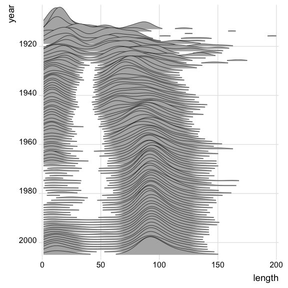

--- 
title: "Introduction aux Data Sciences"
author: "Christophe Benavent - Université Paris Dauphine"
date: "`r Sys.Date()`"
site: bookdown::bookdown_site
output: bookdown::gitbook
documentclass: book
bibliography: [book.bib, packages.bib, datascience.bib]
biblio-style: apalike
link-citations: yes
github-repo: rstudio/bookdown-demo
description: "Cours d'analyse de données et de Datascience"
---


# Avant propos



Ce bookdown présent les éléments d'un cours de data science avec r. Il est reproductible, on peut en cloner les élements à partir du [repository](https://github.com/BenaventC/DataScienceBook). Le texte est encore hasardeux, les codes sont vérifiés. Il sera dynamique, modifié à mesure de nos cours, séminaires et ateliers. 

L'illustration de couverture représente l'évolution de la longueur des films de la base [Imbd](https://www.imdb.com/) et raconte en chiffres un aspect de l'histoire du cinéma. Jusqu'aux années 30, la longueur est hétérogène ensuite elle se se stabilise : les courts-métrages ont une durée de l'ordre de 15mn qui se raccourcit avec les décennies, ce genre menace de disparaître dans les années 80 et reprend du poil de la bête dans les années 2000. Les films longs voient leur longueur s’accroître et se stabiliser autour d'un peu moins de 100 mn, soit une heure et quarante minutes. On observera enfin qu'au cours des années 1990 les films de taille intermédiaires réapparaissent. On devinera dans cette évolution l'émergence de standards, ou de conventions. Les faits viennent au secours des théories...

Dans ce graphique il y a tous les éléments des data sciences contemporaines : un jeu de données riche et systématique, un modèle statistique fondamental avec la notion de densité de probabilité, une mesure, un critère de comparaison. 

Les diagrammes ridges, c'est ainsi qu'on les appelent, sont inspirés de la pochette de l'album [Unknown Pleasures de  Joy division](https://www.youtube.com/watch?v=7PtvIr2oiaE) sorti en pleine période New Wave, en 1979. Un article de Vice en rappele l'[origine et le destin du graphisme](https://i-d.vice.com/fr/article/pabjam/pourquoi-cette-pochette-dalbum-de-joy-division-a-inspire-le-monde-entier) qu'on connait mieux imprimé sur des t-shirt que dans les cours de statistiques.


## Plan du manuel

C'est un projet en cours, Les chapitres projetés sont les suivants. certains sont dans les limbes, d'autres ont pris consistances 

 * 1 - L'environnement r x
 * 2 - Installation et prise en main x
 * 3 - Usage de ggplot - uni et bivarié x
 * 4 - Usage de ggplot - multivarié x
 * 6 - Analyse de variance et régression linéraire x
 * 5 - Tables
 * 6 - Modèles factoriels (Psych) x
 * 7 - AFC x
 * 8 - MDS  
 * 9 - Clustering x
 * 10 - Analyse de réseaux
 * 10 - Modèle d'équations structurelles (Lavaan)
 * 11 - Modèle linéaire généralisé
 * 12 - Modèles à décomposition d'erreur
 * 13 - Times series
 * 14 - Analyse spatiale et géographique
 * 15 - Machine learning x
 

## Les jeux de données 

Au cours du développement, plusieurs cas pratiques - souvent réduit en volume pour rester exemplaire, seront employés. Les données seront partagées.

En voici la présentation  des sets de données utilisées dans le syllabus. Elle sont disponible dans le répertoire "./data/"

 * ESS : c'est une très belle base de données de sociologie.
 * happydemics : observatoire de la présidentielle2022
 * Arpur
 
 
## Le cadre technique et les packages utilisés

Ce  _syllabus_ est écrit en **Markdown** [@allaire_rmarkdown_2021] et  avec le package **Bookdown** [@R-bookdown]. Le code s'appuie sur `tidyverse` et emploie largement les ressources de `ggplot`. Les packages seront introduits au fur et à mesure. En voici la liste complète.


```{r 001, echo = TRUE, message=FALSE,warning=FALSE}
options(tinytex.verbose = TRUE)
knitr::opts_chunk$set(echo = TRUE, include=TRUE, cache=TRUE, message=FALSE, warning=FALSE)

#boite à outils et dataviz
library(tidyverse) # inclut ggplot pour la viz, readr et 
library(cowplot) #pour créer des graphiques composés
library(ggridges) # le joy division touch
library(ggmosaic)

#networks
library(igraph)
library(ggraph)

# Accéder aux données
library(rtweet)  # une interface efficace pour interroger l'api de Twitter

# NLP
library(tokenizers)
library(quanteda)
library(quanteda.textstats)
library(udpipe) #annotation syntaxique
library(tidytext)
library(cleanNLP) #annotation syntaxique

#sentiment
library(syuzhet)             #analyse du sentimeent


#mise en page des tableaux
library(flextable)


#statistiques et modèles
library(lme4) #pour des modèles plus complexe que les mco
library(jtools) #une série d'utiltaire pour bien représenter les résultats
library(interactions) #traitement des interactions

library(corrplot)
library(psych) 

#ACP et AFCM

library("FactoMineR")
library("factoextra")


#ML
library(caret)

#utilitaires
library(rcompanion)

#graphismes
library(ggthemes)
theme_set(theme_bw())


#palettes
library(colorspace) #pour les couleurs
library(wesanderson)

#regression
library(lme4)
library(jtools)
library(interactions)
library(betareg)


# Utilitaires

library(citr) #pour insérer des références dans le markdown

#config plot
theme_set(theme_minimal())
```


L'ensemble du code est disponible [sur github](https://github.com/BenaventC/Datasciences). A ce stade c'est encore embryonnaire. Les proches et nos étudiants pourrons cependant y voir l'évolution du projet et de la [progression](https://benaventc.github.io/Datascience/)

Quelques conventions d'écriture du code r

 * On dénomme les dataframes  de manière générale `df`, les tableaux intermédiaires sont appelé systématiquement `foo`
 * Gestion des palettes de couleurs
  ** une couleur :" royalblue"
  ** deux couleurs
  ** 3 à 7 couleurs
 * On emploie autant que possible le dialecte tidy.
 * Les chunks sont notés en 4 chiffre : 2 pour le chapitre et deux pour le chunck. 0502 est le second chunk du chapitre 5.
 * On commente au maximum les lignes de code pour épargner le corps du texte et le rendre lisible


## A faire

todo list :

* insérer un compteur google analytics ( voir https://stackoverflow.com/questions/41376989/how-to-include-google-analytics-in-an-rmarkdown-generated-github-page)
* modifier le titre en haut à gauche
* vérifier le système de références voir ( https://doc.isara.fr/tuto-zothero-5-bibtex-rmarkdown-zotero/)
* Vérifier la publication en pdf
 
